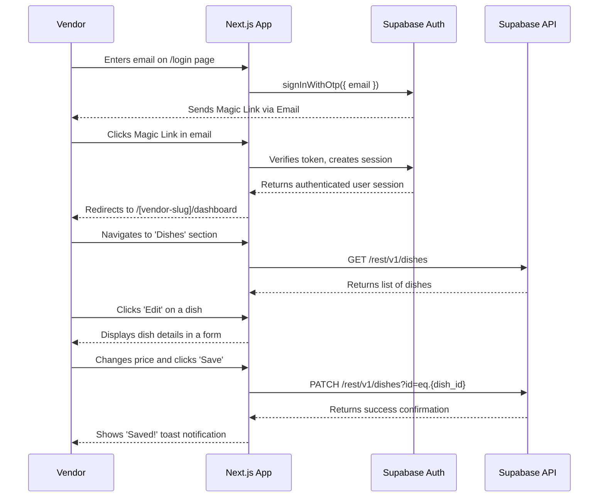
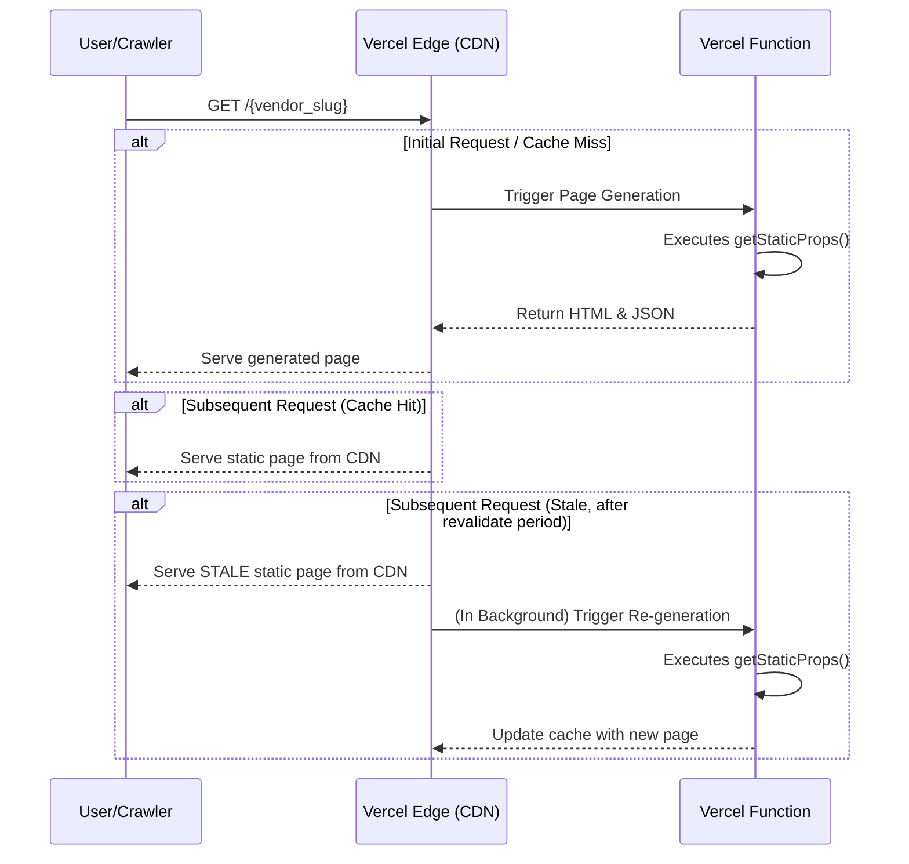

# YumYum Premium Tier Fullstack Architecture

### Section 1 of 18: Introduction

This document outlines the complete fullstack architecture for the YumYum **Premium Tier**. It details the backend systems, frontend implementation, and their integration, serving as the single source of truth for development. This architecture transitions the platform from a simple Google Sheets-based MVP to a scalable, secure, and feature-rich application powered by a robust backend.

#### Section 1.1 of 18: Starter Template or Existing Project

This is an evolution of an existing project. The initial MVP was a greenfield application using Next.js and Google Sheets. This new architecture will be integrated into the existing codebase, replacing the Google Sheets data source with a Supabase backend for premium users.

#### Section 1.2 of 18: Change Log

| Date       | Version | Description                                | Author              |
| :--------- | :------ | :----------------------------------------- | :------------------ |
| 2025-10-21 | 2.0     | Initial architecture for the Premium Tier. | Winston (Architect) |

---

### Section 2 of 18: High Level Architecture

#### Technical Summary

The YumYum Premium Tier architecture is a modern, serverless, fullstack solution designed for scalability and developer efficiency. The frontend remains a **Next.js** application hosted on **Vercel**, providing a fast, responsive user experience. The backend is powered by **Supabase**, which provides a Postgres database, secure authentication (Magic Links), and auto-generated APIs. This architecture directly supports the PRD goals by enabling secure, multi-tenant vendor dashboards, CRUD operations on vendor data, and a clear path for future feature development, all while adhering to the "Free Tier Maximization" principle.

#### Platform and Infrastructure Choice

- **Platform:** Vercel and Supabase
- **Key Services:**
  - **Vercel:** Hosting, CI/CD (Free Tier), SEO.
  - **Supabase:** PostgreSQL Database, Authentication (Magic Link), Storage, Auto-generated APIs.
  - **ImageKit:** Multi-account media hosting and optimization.
  - **Lark:** Webhook for critical alerts.
- **Deployment Host and Regions:** Vercel (Global Edge Network), Supabase (`ap-south-1` Mumbai).

#### Repository Structure

- **Structure:** Monorepo
- **Monorepo Tool:** pnpm workspaces
- **Package Organization:** The existing monorepo structure will be maintained. New backend-related code (e.g., Supabase schema, RLS policies) will be organized within the existing project structure, likely in a new `supabase/` directory at the root.

#### High Level Architecture Diagram

```mermaid
graph TD
    subgraph "Public User"
        U_Browser[User's Browser]
    end

    subgraph "Authenticated User (Vendor)"
        A[Vendor's Browser]
    end

    subgraph "Vercel Platform"
        B_SSR[Next.js Server (SSR)]
        B_CSR[Next.js Client App (CSR)]
    end

    subgraph "Supabase Platform"
        D[Supabase Auth (Magic Link)]
        E[Supabase API (PostgREST)]
        F[PostgreSQL Database]
        SP[Primary Supabase (Mappings)]
    end

    subgraph "External Services"
        G[ImageKit (Media)]
        H[Lark (Alerts)]
        GS[Google Sheets]
    end

    %% Public User Flow (SSR)
    U_Browser -- GET /[vendor_slug] --> B_SSR
    B_SSR -- Reads Mapping --> SP
    B_SSR -- Fetches Data --> F
    B_SSR -- or Fetches Data --> GS
    B_SSR -- Renders HTML --> U_Browser

    %% Authenticated Vendor Flow (CSR)
    A -- Login Request --> B_CSR
    B_CSR -- Calls Auth --> D
    D -- Sends Magic Link --> A
    A -- Clicks Link --> B_CSR
    B_CSR -- Verifies & Creates Session --> D
    B_CSR -- Authenticated API Calls --> E
    E -- Enforces RLS --> F
    B_CSR -- Image Uploads/Views --> G
    E -- Critical Failure --> H
```

#### Architectural Patterns

- **Jamstack Architecture:** The frontend remains a pre-rendered application served from a global CDN, with dynamic functionality handled by client-side JavaScript interacting with the Supabase backend.
  - _Rationale:_ This ensures maximum performance and a great user experience.
- **Backend as a Service (BaaS):** We are leveraging Supabase to provide backend functionality out-of-the-box.
  - _Rationale:_ This dramatically reduces backend development time, allowing us to focus on the vendor-facing dashboard and features.
- **Row-Level Security (RLS):** All data access will be controlled at the database level using Supabase's RLS policies.
  - _Rationale:_ This is a highly secure and scalable way to enforce data isolation between vendors.
- **Client-Side Rendering (CSR) for Dashboard:** The vendor dashboard will be a dynamic, client-side rendered application.
  - _Rationale:_ This provides a rich, app-like experience for logged-in vendors.

---

### Section 3 of 18: Tech Stack

| Category             | Technology                         | Version       | Purpose                                      | Rationale                                                                             |
| :------------------- | :--------------------------------- | :------------ | :------------------------------------------- | :------------------------------------------------------------------------------------ |
| Frontend Language    | TypeScript                         | latest        | Type safety and scalability                  | Industry standard for modern web development, reduces errors.                         |
| Frontend Framework   | Next.js                            | latest        | Core application framework                   | Provides a robust, performant, and scalable foundation for the UI.                    |
| UI Component Library | Shadcn UI, Magic UI, Aceternity UI | latest        | UI components and animations                 | A rich ecosystem to accelerate development and achieve a high-quality, modern finish. |
| State Management     | Zustand                            | latest        | Global state management                      | A small, fast, and scalable solution with a simple hook-based API.                    |
| Backend Language     | TypeScript                         | latest        | Language for Supabase Edge Functions         | To write any necessary server-side logic in a familiar language.                      |
| Backend Framework    | Supabase                           | latest        | Backend as a Service (BaaS)                  | Provides database, auth, and APIs out-of-the-box, accelerating development.           |
| API Style            | REST                               | via PostgREST | Auto-generated APIs for database interaction | Supabase provides a powerful and secure RESTful API layer automatically.              |
| Database             | Supabase (Postgres)                | latest        | Primary data store for premium vendors       | A robust, open-source relational database with excellent performance.                 |
| Cache                | N/A                                | N/A           | Client-side caching will be used             | Caching will be handled at the client level to improve perceived performance.         |
| File Storage         | ImageKit                           | N/A           | Multi-account media hosting and optimization | A powerful solution for managing and serving images efficiently.                      |
| Authentication       | Supabase Auth                      | latest        | Secure user authentication                   | Provides Magic Link (passwordless) login out-of-the-box.                              |
| Frontend Testing     | Jest & React Testing Library       | latest        | Unit and integration testing                 | Industry-standard tools for testing React applications.                               |
| Backend Testing      | Jest                               | latest        | Testing for Supabase Edge Functions          | To ensure any custom server-side logic is reliable.                                   |
| E2E Testing          | Playwright                         | latest        | End-to-end user flow testing                 | A modern and reliable choice for ensuring critical user journeys work as expected.    |
| Build Tool           | SWC (via Next.js)                  | latest        | Fast code compilation                        | Integrated into Next.js for optimal performance.                                      |
| CI/CD                | Vercel                             | N/A           | Continuous integration & deployment          | Seamlessly integrated with the hosting platform for automated builds and deploys.     |
| Monitoring           | Google Analytics 4                 | N/A           | User behavior and funnel tracking            | Provides essential product engagement KPIs.                                           |
| Logging              | Lark Webhook                       | N/A           | Critical error alerting                      | A simple mechanism to alert the development team of critical failures.                |
| CSS Framework        | Tailwind CSS                       | latest        | Utility-first styling                        | Allows for rapid UI development and easy maintenance.                                 |

---

### Section 4 of 18: Data Models (v2)

#### `vendor_mappings`

- **Purpose:** To act as the master directory for all vendors. It will determine whether a vendor's data is on Google Sheets or Supabase and provide the necessary connection info.
- **TypeScript Interface:**

  ```typescript
  export type BackendType = 'supabase' | 'gsheets';

  export interface VendorMapping {
    id: number;
    vendor_slug: string; // e.g., 'the-burger-den'
    backend_type: BackendType; // 'supabase' or 'gsheets'

    // Supabase-specific fields
    supabase_project_id?: string; // Which of the 4 Supabase projects

    // Google Sheets-specific fields
    gsheet_id?: string;

    // ImageKit account is common to both
    imagekit_account_id: string; // Which of the 4 ImageKit accounts
  }
  ```

#### `Brand`

- **Purpose:** Represents the vendor's brand identity.
- **TypeScript Interface:** (No changes from previous version)
  ```typescript
  export interface Brand {
    id: number;
    vendor_id: string; // Foreign Key to auth.users.id
    name: string;
    logo_url: string;
    cuisine: string;
    address?: string;
    city?: string;
    description: string;
    payment_link: string;
    whatsapp: string;
    contact: string;
    location_link?: string;
    review_link?: string;
    instagram?: string;
    facebook?: string;
    youtube?: string;
    custom?: string;
    full_menu_pic?: string;
  }
  ```

#### `Dish`

- **Purpose:** Represents a single menu item.
- **TypeScript Interface (Updated):**
  ```typescript
  export interface Dish {
    id: number;
    vendor_id: string; // Foreign Key to auth.users.id
    category: string;
    name: string;
    description: string | null;
    price: number | null;
    instock: 'yes' | 'no' | 'hide' | null;
    veg: 'veg' | 'non-veg' | null;
    tag: string | null;
    image: string | null;
    reel: string | null;
    created_at: string;
  }
  ```

#### `StatusItem`

- **Purpose:** Represents a single daily status update.
- **TypeScript Interface:**
  ```typescript
  export interface StatusItem {
    id: number;
    brand_id: number; // Foreign Key to Brand.id
    type: 'image' | 'video' | 'text';
    content: string;
    imagekit_file_id?: string; // For deletion from ImageKit
    create_time: string;
  }
  ```

---

### Section 5 of 18: API Specification (v2)

Our API is the auto-generated REST API provided by Supabase. Our formal policy is to interact with this API _exclusively_ through the `@supabase/supabase-js` client library.

- **Interaction Method:** Supabase Client Library (`@supabase/supabase-js`)
- **Rationale:** This is a pragmatic and opinionated choice. Using the client library provides a clean, typed, and consistent interface for all data access. It abstracts away the raw HTTP requests, reduces boilerplate, handles JWT token management automatically, and is the most robust way to work with Supabase. We will _not_ make direct HTTP requests to the PostgREST endpoints.

#### Example Usage (via Supabase Client)

- **Create a new dish:**

  ```typescript
  const { data, error } = await supabase
    .from('dishes')
    .insert({ vendor_id: '...', name: 'New Pizza', ... });
  ```

- **Read all dishes for a vendor:**

  ```typescript
  const { data, error } = await supabase
    .from('dishes')
    .select('*')
    .eq('vendor_id', '...');
  ```

- **Update a dish:**

  ```typescript
  const { data, error } = await supabase
    .from('dishes')
    .update({ price: 15.99 })
    .eq('id', 123);
  ```

- **Delete a dish:**
  ```typescript
  const { data, error } = await supabase.from('dishes').delete().eq('id', 123);
  ```

---

### Section 6 of 18: Components

This section outlines the high-level frontend components required for the Premium Tier vendor dashboard.

#### `VendorDashboard`

- **Responsibility:** Acts as the main layout and container for the entire authenticated vendor experience. It will handle the routing between the different management sections.
- **Dependencies:** `AuthManager`, `DashboardNav`.

#### `DishesManagement`

- **Responsibility:** Provides the full CRUD interface for a vendor to manage their dishes. It will include a data table to list dishes and a form to add/edit them.
- **Dependencies:** `DataTable`, `EntityForm`, Supabase client.

#### `BrandProfileManagement`

- **Responsibility:** Provides a form for the vendor to update their brand profile information.
- **Dependencies:** `EntityForm`, Supabase client.

#### `StatusManagement`

- **Responsibility:** Provides an interface for the vendor to manage their daily status updates.
- **Dependencies:** `EntityForm`, Supabase client.

#### `AuthManager`

- **Responsibility:** Handles the entire authentication flow, including the Magic Link login form, redirect handling, and logout functionality.
- **Dependencies:** Supabase client.

#### `DataTable`

- **Responsibility:** A reusable component to display lists of data (e.g., dishes) in a table with sorting, filtering, and action buttons.
- **Dependencies:** Shadcn UI Table component.

#### `EntityForm`

- **Responsibility:** A generic, reusable form component for creating and editing entities (Dishes, Brand Profile, Status). It will include input fields, validation, and the ImageKit image uploader.
- **Dependencies:** React Hook Form, Shadcn UI Form components, ImageKit uploader.

#### `PublicVendorPage`

- **Responsibility:** Renders the entire public-facing vendor page. This is a Server Component that fetches its own data for ISR.
- **Dependencies:** `BrandHeader`, `CategoryHighlights`, `ControlsBar`, `DishGrid`.

---

### Section 7 of 18: External APIs

This section details the external services the YumYum Premium Tier will integrate with.

#### Supabase API

- **Purpose:** Serves as the primary backend for data storage, authentication, and serverless functions.
- **Documentation:** [https://supabase.com/docs](https://supabase.com/docs)
- **Authentication:** API Key and JWT for client-side access.

#### ImageKit API

- **Purpose:** Hosts, optimizes, and serves all media assets (vendor logos, dish images).
- **Documentation:** [https://docs.imagekit.io/](https://docs.imagekit.io/)
- **Authentication:** API Key and Secret for upload operations.

#### Lark Webhook API

- **Purpose:** Used for sending critical system alerts to the development team's communication channel.
- **Documentation:** Specific to the configured incoming webhook URL.
- **Authentication:** None (relies on the secrecy of the webhook URL).

---

### Section 8 of 18: Core Workflows

This diagram illustrates the sequence of events for a vendor logging in and updating a dish in the new Premium Tier dashboard.



This ensures that only registered vendors can access the system and are directed to their personalized dashboard immediately after login.

## 8.2 Top Vendors List Automation

- **Purpose:** To automatically generate and update a list of the most visited vendor pages for display on the homepage.
- **Process:** A weekly GitHub Actions workflow queries Google Analytics data from BigQuery (based on total page views for `/[vendor_slug]` pages), fetches additional vendor details (name, cuisine, logo_url) from Supabase, and saves the top 10 vendors to a static JSON file (`public/top-vendors.json`).
- **Data Source:** Google Analytics 4 (GA4) via BigQuery Export.
- **Trigger:** Weekly GitHub Actions cron job (every Sunday at 00:00 UTC).
- **Output:** `public/top-vendors.json` (consumed by `TopVendorsSection` component on the homepage).

---

### Section 9 of 18: Database Schema (v3)

This section provides the SQL schema for the tables in our Supabase Postgres database, now including custom `ENUM` types for data integrity.

-- Function to automatically update modify_time
CREATE OR REPLACE FUNCTION public.update_modify_time()
RETURNS TRIGGER AS $
BEGIN
    NEW.modify_time = now();
    RETURN NEW;
END;
$ language 'plpgsql';

-- Function to get user ID by email for secure server-side checks
CREATE OR REPLACE FUNCTION get_user_id_by_email(user_email TEXT)
RETURNS TABLE (id UUID, email TEXT)
LANGUAGE plpgsql
SECURITY DEFINER
SET search_path = public;
AS $
BEGIN
  RETURN QUERY
  SELECT au.id, au.email
  FROM auth.users au
  WHERE au.email = user_email;
END;
$;


-- ENUM Types
CREATE TYPE instock_status AS ENUM ('yes', 'no', 'hide');
CREATE TYPE dietary_info AS ENUM ('veg', 'non-veg');
CREATE TYPE status_type AS ENUM ('image', 'video', 'text');

-- ##################################################
-- ### SCHEMA FOR THE PRIMARY SUPABASE PROJECT ###
-- ##################################################

-- Table for vendor mappings and membership data
CREATE TABLE public.vendor_mappings (
    id bigint GENERATED BY DEFAULT AS IDENTITY PRIMARY KEY,
    vendor_slug text NOT NULL UNIQUE,
    auth_user_id uuid REFERENCES auth.users(id) ON DELETE SET NULL,
    datastore_type text NOT NULL,
    datastore_id text NOT NULL,
    imagekit_account_id text NOT NULL,
    is_member boolean DEFAULT true NOT NULL,
    membership_fee real DEFAULT 0,
    membership_validity date DEFAULT (now() + '10 days'::interval),
    create_time timestamp with time zone DEFAULT now() NOT NULL,
    modify_time timestamp with time zone DEFAULT now() NOT NULL
);

-- Trigger to update modify_time on changes to vendor_mappings
CREATE TRIGGER handle_updated_at BEFORE UPDATE ON public.vendor_mappings
  FOR EACH ROW EXECUTE PROCEDURE public.update_modify_time();

-- Table for tracking vendor payments
CREATE TABLE public.vendor_payment (
    id bigint GENERATED BY DEFAULT AS IDENTITY PRIMARY KEY,
    vendor_id bigint NOT NULL REFERENCES public.vendor_mappings(id) ON DELETE CASCADE,
    payment real NOT NULL,
    payment_date date NOT NULL,
    payment_duration interval NOT NULL,
    create_time timestamp with time zone DEFAULT now() NOT NULL,
    modify_time timestamp with time zone DEFAULT now() NOT NULL
);

-- Trigger to update modify_time on changes to vendor_payment
CREATE TRIGGER handle_updated_at BEFORE UPDATE ON public.vendor_payment
  FOR EACH ROW EXECUTE PROCEDURE public.update_modify_time();


-- #####################################################
-- ### SCHEMA FOR EACH VENDOR-SPECIFIC PROJECT ###
-- #####################################################

-- Table for vendor brand profiles
CREATE TABLE public.brand (
  id bigint GENERATED BY DEFAULT AS IDENTITY PRIMARY KEY,
  auth_user_id uuid NOT NULL REFERENCES auth.users(id) ON DELETE CASCADE,
  name text NOT NULL,
  logo_url text,
  cuisine text,
  address text,
  city text,
  description text,
  payment_link text,
  whatsapp text,
  contact text,
  location_link text,
  review_link text,
  instagram text,
  facebook text,
  youtube text,
  custom text,
  full_menu_pic text,
  create_time timestamp with time zone DEFAULT now() NOT NULL,
  modify_time timestamp with time zone DEFAULT now() NOT NULL
);

-- Trigger to update modify_time on changes to brand
CREATE TRIGGER handle_updated_at BEFORE UPDATE ON public.brand
  FOR EACH ROW EXECUTE PROCEDURE public.update_modify_time();

-- Table for individual menu items (dishes)
CREATE TABLE public.dishes (
  id bigint GENERATED BY DEFAULT AS IDENTITY PRIMARY KEY,
  brand_id bigint NOT NULL REFERENCES public.brand(id) ON DELETE CASCADE,
  category text NOT NULL,
  name text NOT NULL,
  image text,
  reel text,
  description text,
  price real,
  instock instock_status DEFAULT 'yes',
  veg dietary_info,
  tag text,
  create_time timestamp with time zone DEFAULT now() NOT NULL,
  modify_time timestamp with time zone DEFAULT now() NOT NULL
);

-- Trigger to update modify_time on changes to dishes
CREATE TRIGGER handle_updated_at BEFORE UPDATE ON public.dishes
  FOR EACH ROW EXECUTE PROCEDURE public.update_modify_time();

-- Table for daily status updates from vendors
CREATE TABLE public.status_item (
  id bigint GENERATED BY DEFAULT AS IDENTITY PRIMARY KEY,
  brand_id bigint NOT NULL REFERENCES public.brand(id) ON DELETE CASCADE,
  type status_type NOT NULL,
  content text NOT NULL,
  imagekit_file_id text,
  create_time timestamp with time zone DEFAULT now() NOT NULL
);


-- ##################################################
-- ### ROW LEVEL SECURITY (RLS) POLICIES ###
-- ##################################################

-- RLS for public.vendor_mappings (Primary DB)
ALTER TABLE public.vendor_mappings ENABLE ROW LEVEL SECURITY;
CREATE POLICY "Vendors can view their own mappings."
ON public.vendor_mappings FOR SELECT
USING (auth.uid() = auth_user_id);
CREATE POLICY "Vendors can update their own mappings."
ON public.vendor_mappings FOR UPDATE
USING (auth.uid() = auth_user_id);
CREATE POLICY "Admins can manage all mappings."
ON public.vendor_mappings FOR ALL
USING (true); -- Placeholder for admin role check, assumes full admin access for now

-- RLS for public.vendor_payment (Primary DB)
ALTER TABLE public.vendor_payment ENABLE ROW LEVEL SECURITY;
CREATE POLICY "Admins can manage payments."
ON public.vendor_payment FOR ALL
USING (true); -- Placeholder for admin role check, assumes full admin access for now


-- RLS for public.brand (Vendor DB)
ALTER TABLE public.brand ENABLE ROW LEVEL SECURITY;
CREATE POLICY "Vendors can manage their own brand"
ON public.brand FOR ALL
USING (auth.uid() = auth_user_id);

-- RLS for public.dishes (Vendor DB)
ALTER TABLE public.dishes ENABLE ROW LEVEL SECURITY;
CREATE POLICY "Vendors can manage their own dishes"
ON public.dishes FOR ALL
USING (
  (EXISTS ( SELECT 1
   FROM public.brand
  WHERE ((public.brand.id = dishes.brand_id) AND (public.brand.auth_user_id = auth.uid()))))
);

-- RLS for public.status_item (Vendor DB)
ALTER TABLE public.status_item ENABLE ROW LEVEL SECURITY;
CREATE POLICY "Vendors can manage their own status items"
ON public.status_item FOR ALL
USING (
  (EXISTS ( SELECT 1
   FROM public.brand
  WHERE ((public.brand.id = status_item.brand_id) AND (public.brand.auth_user_id = auth.uid()))))
);


---

### Section 10 of 18: Frontend Architecture

This section details the frontend-specific architecture for the Premium Tier dashboard.

#### Component Architecture

- **Component Organization:**
  ```plaintext
  /src/
  ├── app/
  │   ├── (auth)/
  │   │   └── login/
  │   │       └── page.tsx
  │   └── (dashboard)/
  │       ├── vendor/
  │       │   └── dashboard/
  │       │       ├── layout.tsx
  │       │       └── page.tsx
  │       └── layout.tsx
  ├── components/
  │   ├── features/
  │   │   ├── dashboard/
  │   │   └── auth/
  │   ├── shared/
  │   └── ui/
  └── ...
  ```
- **Component Template:** We will continue to use the `shadcn/ui` component structure, using `React.forwardRef` and `cn` for class name merging.

#### State Management

- **Global State:** Zustand will be used for managing global UI state and the authenticated user session.
  - `use-ui-store.ts`: For managing UI state like modals, notifications, etc.
  - `use-auth-store.ts`: For storing the user session and authentication status.
- **Form State:** React Hook Form will be used for managing all form state within the dashboard.
- **Server State:** We will use Supabase's client library for managing server state, including caching and revalidation of data fetched from the database.

#### Routing

- **`/login`**: Public route for the Magic Link login form.
- **`/[vendor-slug]/dashboard`**: A protected route that will redirect to `/login` if the user is not authenticated. This will be the main entry point for the vendor dashboard.
- **Protected Route Pattern:** We will implement a higher-order component (HOC) or a layout component that checks for an active user session. If no session exists, it will redirect the user to the `/login` page.

#### Frontend Services Layer

- **API Client:** We will use the official `@supabase/supabase-js` client library to interact with the Supabase backend.
- **Service Example (`src/services/dishes.ts`):**

  ```typescript
  import { supabase } from '@/lib/supabase';
  import { Dish } from '@/lib/types';

  export async function getDishes(): Promise<Dish[]> {
    const { data, error } = await supabase.from('dishes').select('*');
    if (error) throw error;
    return data;
  }

  export async function updateDish(
    id: number,
    updates: Partial<Dish>,
  ): Promise<Dish> {
    const { data, error } = await supabase
      .from('dishes')
      .update(updates)
      .eq('id', id)
      .select(); // Return the updated row

    if (error) throw error;
    if (!data || data.length === 0)
      throw new Error('Dish not found or could not be updated.');

    return data[0];
  }
  ```

---

### Section 11 of 18: Backend Architecture

Our backend is provided by **Supabase** as a "Backend as a Service" (BaaS). We will not be writing a traditional backend application. Instead, we will configure and use the services provided by Supabase.

#### Service Architecture

- **Serverless Functions:** If any custom server-side logic is required (e.g., for integrating with a third-party service that requires a secret key), we will use **Supabase Edge Functions**. These are Deno-based TypeScript functions.
  - **Function Organization:**
    ```plaintext
    /supabase/
    └── functions/
        ├── some-function/
        │   └── index.ts
        └── ...
    ```

#### Database Architecture

- **Schema:** The database schema is defined in Section 9. We will use the Supabase UI and SQL scripts to manage the schema.
- **Data Access:** All data access from the frontend will be through the auto-generated PostgREST API. We will not be writing custom data access layers in the backend.

#### Authentication and Authorization

- **Authentication:** We will use Supabase's built-in Magic Link (passwordless) authentication.
- **Authorization:** Authorization will be enforced using Postgres **Row Level Security (RLS)** policies. This is the cornerstone of our security model.
  - **RLS Policy Example (for `dishes` table):**

    ```sql
    -- 1. Enable RLS on the table
    ALTER TABLE public.dishes ENABLE ROW LEVEL SECURITY;

    -- 2. Allow vendors to see only their own dishes
    CREATE POLICY "Vendors can view their own dishes"
    ON public.dishes FOR SELECT
    USING (auth.uid() = vendor_id);

    -- 3. Allow vendors to insert dishes for themselves
    CREATE POLICY "Vendors can insert their own dishes"
    ON public.dishes FOR INSERT
    WITH CHECK (auth.uid() = vendor_id);

    -- 4. Allow vendors to update their own dishes
    CREATE POLICY "Vendors can update their own dishes"
    ON public.dishes FOR UPDATE
    USING (auth.uid() = vendor_id);

    -- 5. Allow vendors to delete their own dishes
    CREATE POLICY "Vendors can delete their own dishes"
    ON public.dishes FOR DELETE
    USING (auth.uid() = vendor_id);
    ```

---

### Section 12 of 18: Unified Project Structure

This is the target project structure for our monorepo.

```plaintext
/
├── docs/
│   ├── architecture.md
│   ├── prd.md
│   └── ...
├── src/
│   ├── app/
│   │   ├── (auth)/
│   │   │   └── login/
│   │   ├── (dashboard)/
│   │   │   └── vendor/
│   │   │       └── dashboard/
│   │   └── [vendor_slug]/
│   │       └── page.tsx      # <-- Public, server-rendered vendor page
│   ├── components/
│   ├── lib/
│   ├── services/
│   └── store/
├── supabase/
│   ├── migrations/
│   │   └── 0001_initial_schema.sql
│   └── functions/
│       └── ...
├── wiki/                 # Training materials and team onboarding docs
├── package.json
├── pnpm-lock.yaml
└── ...
```

---

### Section 13 of 18: Public-Facing Architecture (SEO)

This section details the architecture for the public-facing vendor brand pages (e.g., `/the-burger-den`), which are critical for search engine discoverability while adhering to our "Free Tier Maximization" principle.

#### Rendering Strategy: Static Site Generation (SSG) with Incremental Static Regeneration (ISR)

To ensure vendor pages are fast, SEO-friendly, and cost-effective, we will use **SSG with ISR**.

- **Rationale:** Pure Server-Side Rendering (SSR) executes on every request, risking high costs that could exceed Vercel's free tier limits. ISR provides the perfect balance: pages are pre-built as static HTML for maximum performance and SEO, and then automatically re-generated in the background at a defined interval (e.g., every 5 minutes). This dramatically reduces function invocations, keeping us within the free tier, while ensuring data remains reasonably fresh.

#### ISR Data Flow

The following diagram illustrates the data flow for a public vendor page request.



#### Implementation Details

- **Data Fetching:** Data for a vendor page will be fetched directly within the `page.tsx` Server Component. We will use `fetch` requests to our own API routes (which in turn fetch from Supabase/GSheets) or directly use the Supabase client on the server.
- **Revalidation:** To achieve ISR, the primary data fetch will use the `next: { revalidate: 300 }` option. This instructs Next.js to cache the page for 300 seconds (5 minutes), after which a new request will trigger a background regeneration.
  ```typescript
  // Example within a data-fetching service
  fetch('https://.../data', { next: { revalidate: 300 } });
  ```
- **Static Generation:** To pre-build pages for known vendors at build time, we will export a `generateStaticParams` function from `src/app/[vendor_slug]/page.tsx`. This function will return a list of all `vendor_slug`s to be generated.

#### On-Page SEO Strategy

To ensure our vendor pages rank well for specific search queries (e.g., "Eggsperiment" or "dishes of Eggsperiment"), we will implement a dynamic metadata strategy.

- **`generateMetadata` Function:** In `src/app/[vendor_slug]/page.tsx`, we will export an async function called `generateMetadata`. This server-side function will fetch the specific vendor's brand and dish data.
- **Dynamic Title:** The function will generate a unique, descriptive `<title>` tag for each vendor.
  - _Example:_ `<title>Eggsperiment Menu | Delicious Dishes & Offers | YumYum</title>`
- **Dynamic Meta Description:** The function will generate a compelling `<meta name="description">` tag that includes the vendor's name and some of their popular dishes, encouraging clicks from search results.
  - _Example:_ `<meta name="description" content="Explore the official menu of Eggsperiment on YumYum, featuring our famous Spicy Paneer Pizza and Cheesy Garlic Bread. Order online now!">`

This approach ensures that every vendor page sends strong, specific signals to search engines, directly addressing the goal of making vendors highly discoverable on the internet.

---

### Section 14 of 18: Deployment Architecture

This section outlines the deployment strategy for the YumYum Premium Tier application.

#### Deployment Strategy

- **Platform:** The frontend application is hosted and deployed on **Vercel**. The backend services (database, auth, functions) are managed by **Supabase**.
- **Deployment Method:** We use a **Continuous Deployment** model integrated with our Git repository.
  - **Production:** Every push or merge to the `main` branch automatically triggers a build and deployment to the production environment.
  - **Previews:** A unique preview deployment is automatically generated for every pull request, allowing for review and testing before merging.

#### CI/CD Pipeline

- **Provider:** The CI/CD pipeline is managed entirely by **Vercel**.
- **Build Command:** `pnpm build`
- **Output Directory:** `.next`
- **Framework Preset:** Next.js

#### Database Migrations

- **Tooling:** Supabase database schema changes will be managed using the **Supabase CLI**.
- **Workflow:**
  1.  Developers will generate new migration files locally using the CLI.
  2.  These migration files will be committed to the repository in the `/supabase/migrations` directory.
  3.  When deploying changes to the Supabase backend (e.g., staging or production), these migrations will be applied manually using the Supabase CLI to ensure controlled updates.

## 14.1 Environment Variable Management

- **Purpose:** To securely manage configuration settings and sensitive credentials across different environments (local, development, production).
- **Local Development:** Environment variables are managed in a `.env.local` file, which is based on the `.env.local.example` template. This file is excluded from version control.
- **Production/Deployment:** Variables are securely configured in the hosting platform (e.g., Vercel) and GitHub Actions secrets.
- **Public vs. Private:**
  - **Public Variables:** Prefixed with `NEXT_PUBLIC_` (e.g., `NEXT_PUBLIC_SUPABASE_ACCT_1_URL`). These are safe to expose to the client-side application.
  - **Private Variables:** Not prefixed with `NEXT_PUBLIC_` (e.g., `SUPABASE_SERVICE_ROLE_KEY`, `GA4_BIGQUERY_PROJECT_ID`). These must _never_ be exposed to the client-side and are used only in server-side code or build processes.
- **Consistency:** The `.env.local.example` file serves as the single source of truth for all required environment variables, detailing their purpose and whether they are public or private.

---

### Section 15 of 18: Security and Performance

This section covers the key strategies for ensuring the application is secure and performant.

#### Security Requirements

Our security model is based on a defense-in-depth approach, leveraging the capabilities of our chosen platforms.

- **Authentication:** All vendor authentication is handled by **Supabase Auth**, using passwordless Magic Links. This outsources the complexity of password management and reduces the risk of credential theft.
- **Authorization:** The cornerstone of our data security is **Postgres Row-Level Security (RLS)**. RLS policies, defined in Section 11, ensure that a vendor can _only_ access and modify their own data. These policies are enforced at the database level, providing a robust barrier against unauthorized data access.
- **API Security:** By using the official Supabase client library, we ensure that JWTs are managed securely and automatically. All API access is governed by the RLS policies.
- **Secret Management:** All sensitive information, such as API keys and database URLs, are stored as environment variables in Vercel and are not exposed to the client-side application.
- **Infrastructure Security:** We rely on Vercel and Supabase to manage infrastructure-level security, including DDoS protection, firewalling, and physical security.

#### Performance Optimization

- **Public Pages (SEO):** The public-facing vendor pages (`/[vendor_slug]`) use **Static Site Generation (SSG) with Incremental Static Regeneration (ISR)**. This provides extremely fast static pages from the CDN that are perfect for SEO, while ensuring data is kept fresh automatically in the background.
- **Authenticated Dashboard (CSR):** The vendor dashboard is a **Client-Side Rendered (CSR)** application. This provides a fast, app-like experience after the initial load, as navigation between sections does not require full page reloads.
- **Global CDN:** All static assets and server-rendered pages are cached and served from **Vercel's Global Edge Network**, ensuring low latency for users worldwide.
- **Media Optimization:** All images and media assets are served via **ImageKit**, which provides automatic optimization, format selection (e.g., WebP), and CDN delivery.
- **Client-Side Caching:** The application will leverage browser caching and client-side state management (Zustand) to minimize redundant data fetching during a user session.

---

### Section 16 of 18: Testing Strategy

Our testing strategy follows the "Testing Pyramid" model to ensure a high degree of confidence in our application's stability and correctness.

- **Tools:**
  - **Unit & Integration Testing:** Jest & React Testing Library
  - **End-to-End Testing:** Playwright

#### Unit Tests

- **Scope:** Individual components in isolation, utility functions, and Zustand stores.
- **Goal:** To verify that the smallest units of our application work as expected. For components, this means testing that they render correctly given specific props. For functions, it means testing their outputs given various inputs.
- **Location:** `__tests__` directories co-located with the source files.

#### Integration Tests

- **Scope:** The interaction between multiple components that form a single feature. For example, testing the `DishesManagement` feature by simulating a user adding a new dish through the form and verifying that it appears in the data table.
- **Goal:** To ensure that different parts of a feature are wired together correctly and that data flows between them as expected.
- **Location:** `__tests__/components/features`

#### End-to-End (E2E) Tests

- **Scope:** Critical user journeys that span multiple pages and features of the application.
- **Goal:** To simulate a real user's workflow from start to finish and catch issues in the integrated system that unit or integration tests might miss.
- **Example Flows:**
  1.  **Vendor Login & CRUD:** A vendor successfully logs in via Magic Link, navigates to the dashboard, creates a new dish, updates its price, and then deletes it.
  2.  **Public Page Load:** A public user successfully loads a vendor's page, and the menu items are rendered correctly from the backend.

---

### Section 17 of 18: Coding Standards

To ensure a high-quality and consistent codebase, all development must adhere to the following standards.

- **Formatting:** All code will be automatically formatted using **Prettier** on save and before commits. This is non-negotiable and ensures a uniform style across the entire project.

- **Linting:** We use **ESLint** to statically analyze the code and find problems. ESLint rules are defined in `eslint.config.mjs` and must be followed.

- **Naming Conventions:**
  - **Components:** `PascalCase` (e.g., `DishCard`, `VendorDashboard`).
  - **Files:** `kebab-case` (e.g., `use-debounce.ts`, `gsheets.ts`).
  - **Functions & Variables:** `camelCase` (e.g., `getDishes`, `vendorId`).
  - **Types & Interfaces:** `PascalCase` (e.g., `VendorMapping`, `Dish`).

- **Component Structure:** All new components should follow the `shadcn/ui` pattern, using `React.forwardRef` and the `cn` utility for merging classes. This ensures consistency and composability.

- **Data Fetching:** All interaction with external or backend services **must** be abstracted into the `/src/services` layer. Components should not contain direct data fetching logic (e.g., `fetch` calls or direct Supabase client calls). They should call service functions instead.

- **Type Safety:** The use of `any` is strictly discouraged. Always define specific types or interfaces for data structures.

---

### Section 18 of 18: Error Handling & Monitoring

This section describes our approach to handling errors and monitoring the application in production.

#### Error Handling

- **UI Layer:**
  - **User Feedback:** When an operation fails (e.g., saving a form), the user will be presented with a non-intrusive toast notification or an inline error message explaining the issue.
  - **State Preservation:** Forms will preserve user input upon a submission failure, preventing data loss and frustration.
  - **Error Boundaries:** React Error Boundaries will be used to catch rendering errors in component sub-trees, preventing a full application crash and displaying a fallback UI.

- **Service & API Layer:**
  - Service functions in `/src/services` are responsible for catching errors from external APIs (e.g., Supabase, ImageKit).
  - Caught errors will be re-thrown as standardized application errors, which the UI layer can then interpret to display the appropriate user message.

#### Monitoring

Our monitoring strategy is focused on three key areas:

1.  **User Behavior Analytics:**
    - **Tool:** Google Analytics 4 (GA4).
    - **Purpose:** To understand how users are interacting with the application, track conversion funnels, and measure feature adoption.

2.  **Application Performance:**
    - **Tool:** Vercel Analytics.
    - **Purpose:** To monitor Core Web Vitals (LCP, FID, CLS) and overall application performance from the perspective of real users.

3.  **Critical Failure Alerting:**
    - **Tool:** Lark Webhook.
    - **Purpose:** To provide immediate, real-time alerts to the development team when a critical backend operation fails. This is reserved for severe issues that require immediate attention, such as a failure to connect to the Supabase database or a critical authentication error.
