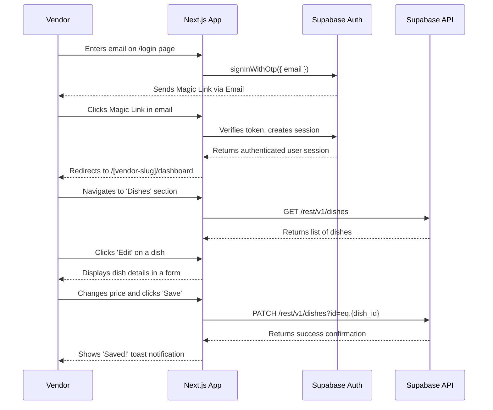
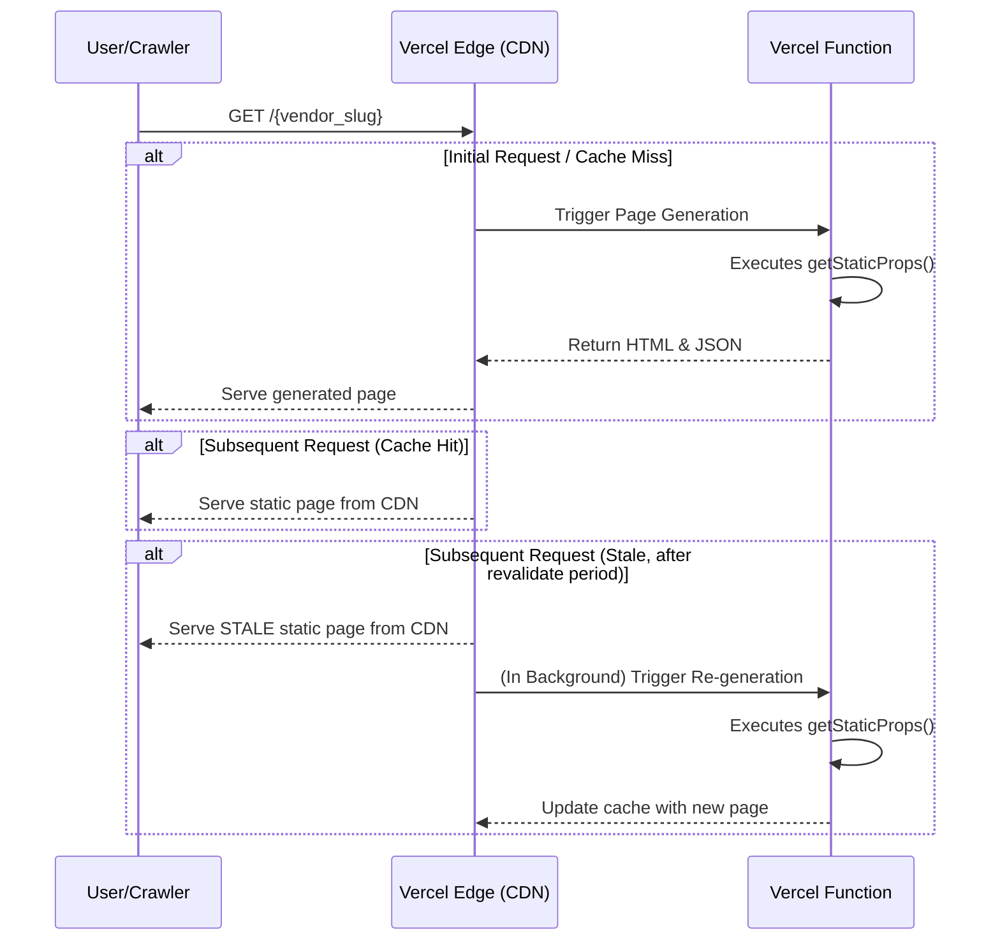

# YumYum Premium Tier Fullstack Architecture

### Section 1 of 18: Introduction

This document outlines the complete fullstack architecture for the YumYum **Premium Tier**. It details the backend systems, frontend implementation, and their integration, serving as the single source of truth for development. This architecture transitions the platform from a simple Google Sheets-based MVP to a scalable, secure, and feature-rich application powered by a robust backend.

#### Section 1.1 of 18: Starter Template or Existing Project

This is an evolution of an existing project. The initial MVP was a greenfield application using Next.js and Google Sheets. This new architecture will be integrated into the existing codebase, replacing the Google Sheets data source with a Supabase backend for premium users.

#### Section 1.2 of 18: Change Log

| Date       | Version | Description                                | Author              |
| :--------- | :------ | :----------------------------------------- | :------------------ |
| 2025-10-21 | 2.0     | Initial architecture for the Premium Tier. | Winston (Architect) |

---

# Architecture Decision Document

_This document builds collaboratively through step-by-step discovery. Sections are appended as we work through each architectural decision together._

## 1. System Overview

YumYum is a multi-tenant SaaS platform built on a decoupled architecture, prioritizing zero infrastructure cost, high performance, and rapid scalability. It leverages Next.js for a fast client-side static frontend, Python FastAPI for a robust API backend, Supabase as its primary BaaS, and two Cloudinary accounts for resilient media asset management.

## 2. Technical Stack

- **Platform:** Vercel and Supabase
- **Key Services:**
  - **Vercel:** Hosting, CI/CD (Free Tier), SEO.
  - **Supabase:** PostgreSQL Database, Authentication (Magic Link), Storage, Auto-generated APIs.
  - **ImageKit:** Multi-account media hosting and optimization.
  - **Lark:** Webhook for critical alerts.
- **Deployment Host and Regions:** Vercel (Global Edge Network), Supabase (`ap-south-1` Mumbai).

*   **Frontend:** Next.js (TypeScript, client-side static generation)
*   **Backend (API):** Python FastAPI
*   **Styling:** Tailwind CSS, Shadcn UI
*   **UI Components:** Magic UI, Aceternity UI, Reactbits
*   **State Management:** Zustand
*   **Backend as a Service (BaaS):** Supabase (PostgreSQL, Auth, RLS)
*   **Media Hosting & CDN:** Cloudinary (2 accounts for redundancy and capacity)
*   **Hosting (Frontend):** Vercel
*   **Hosting (Backend API):** Render (for containerized FastAPI deployment)
*   **Analytics:** Google Analytics 4 (GA4)

## 3. High-Level Architecture

- **Structure:** Monorepo
- **Monorepo Tool:** pnpm workspaces
- **Package Organization:** The existing monorepo structure will be maintained. New backend-related code (e.g., Supabase schema, RLS policies) will be organized within the existing project structure, likely in a new `supabase/` directory at the root.

### 3.1 Overall System Architecture
The system employs a decoupled, multi-tier architecture to ensure high performance, scalability, and maintainability.
*   **Frontend (Next.js):** Served as client-side static assets by Vercel, ensuring blazing-fast load times. It consumes data and services from the FastAPI backend and directly interacts with Supabase for authentication and real-time data where appropriate.
*   **Backend (FastAPI):** A Python-based API layer hosted on Render, responsible for complex business logic, data processing, and orchestrating interactions between various services. It communicates with Supabase for data persistence and Cloudinary for media management.
*   **BaaS (Supabase):** Provides robust PostgreSQL database capabilities, authentication, and Row Level Security (RLS) for multi-tenancy.
*   **Media Management (Cloudinary):** Two separate Cloudinary accounts are used to manage video and media assets, providing redundancy, high availability, and efficient CDN delivery.

### 3.2 Multi-Tenancy
Multi-tenancy is handled primarily via Supabase Row Level Security (RLS) on the database level. Every table includes a `vendor_id` column linked to `auth.users.id`. The FastAPI backend will enforce additional business logic for multi-tenancy and data isolation.
*   **Vendor Access:** Vendors can only read/write their own data via the frontend, with both FastAPI and Supabase RLS enforcing permissions.
*   **Public Access:** Customers can read public menu data for any vendor via the `vendor_slug` through the Next.js frontend, consuming data from FastAPI.

### 3.3 Data Flow
1.  **Vendor Management:** Vendors log in via Supabase Magic Link through the Next.js frontend. The frontend interacts with FastAPI for managing menu data, which in turn updates Supabase and potentially Cloudinary for media assets.
2.  **Customer Interaction:** Customers scan a QR code leading to `yumyum.zupfam.com/{vendor-slug}`. The Next.js frontend fetches menu data from FastAPI.
3.  **Event Emission:** Client-side actions (views, clicks, adds) are sent as raw events to the FastAPI backend, which then writes to the `menu_events` table in Supabase.
4.  **Analytics Pipeline:** Dashboards (internal or vendor-facing) query the `menu_events` table via FastAPI to aggregate data on-the-fly for real-time reporting.

## 4. Database Schema (Canonical)

The system uses a relational PostgreSQL schema (managed by Supabase) designed for event-based analytics and multi-tenant isolation. The FastAPI application will interact with this schema.

### 4.1 Core Entities
*   **`vendors`:** Primary vendor profile and settings.
*   **`dishes`:** Menu items categorized and priced.
*   **`vendor_updates`:** Promotional "stories" or daily specials.
*   **`vendor_social_accounts`:** External links (Instagram, WhatsApp, etc.).

    subgraph "External Services"
        G[ImageKit (Media)]
        H[Lark (Alerts)]
        GS[Google Sheets]
    end

### 4.2 Behavioral Data
*   **`menu_events`:** The polymorphic event stream for all analytics.
*   **`update_interactions`:** High-frequency interaction tracking for vendor updates.

(Detailed SQL schema is available in `GEMINI.md`)

## 5. Security Strategy

*   **Authentication:** Supabase Magic Link for passwordless, secure vendor entry (managed by Next.js frontend and integrated with FastAPI).
*   **Authorization:** Strict RLS policies on all Supabase tables, augmented by FastAPI's role-based access control (RBAC) and data validation.
*   **API Security:** FastAPI will implement rate limiting, input validation, and proper error handling. API keys/tokens will be managed securely.
*   **Public Data:** Publicly accessible views/tables are limited to read-only for non-authenticated users via both RLS and FastAPI endpoint controls.

## 6. Infrastructure & Deployment

*   **Frontend (Next.js):** Deployed on **Vercel** with automatic CI/CD integration from GitHub. Leveraging Vercel's CDN for global distribution of static assets.
*   **Backend (FastAPI):** Deployed as a containerized application on **Render**. Render provides managed infrastructure, auto-scaling, and CI/CD integration with GitHub, aligning with the "zero infra cost" philosophy (initially). FastAPI will run with Uvicorn and Gunicorn workers for production-grade performance.
*   **Media Hosting & CDN (Cloudinary):** Two distinct Cloudinary accounts will be used. This provides redundancy, enhanced rate limits, and potentially allows for functional separation (e.g., one for public media, one for private/vendor-uploaded). Cloudinary handles automatic resizing, formatting, optimization, and global CDN delivery of images and videos.
*   **Database (Supabase):** Managed cloud service by Supabase, handling database scaling, backups, and security patches.
*   **Environment Variables:** Securely managed via Vercel, Render, and Supabase platforms.
*   **CI/CD:** Automated deployments for both frontend (Vercel) and backend (Render) via GitHub.

## 7. Operational Roadmap

1.  **Phase 1:** Core menu rendering (Next.js), event tracking (FastAPI -> Supabase), and basic vendor authentication (Next.js -> Supabase). Cloudinary integration for media.
2.  **Phase 2:** Vendor dashboard for menu and media management (Next.js -> FastAPI -> Supabase/Cloudinary).
3.  **Phase 3:** Advanced analytics and reporting via WhatsApp (FastAPI).

## Project Context Analysis

### Requirements Overview

**Functional Requirements:**
The core functional requirements revolve around establishing a robust digital storefront for hyperlocal food vendors. These include creating a vendor-specific digital brand page accessible via QR code, an interactive Instagram-style dynamic menu, and a seamless client-side cart with integrated WhatsApp ordering. Additionally, the system must provide a secure vendor login (Magic Link authentication) and a vendor metrics dashboard to track key performance indicators.

**Non-Functional Requirements:**
Key non-functional requirements are critical for the project's success. **Performance** is paramount, demanding a "blazing-fast" experience from QR scan to order completion, with instantaneous menu loads and interactions. **Scalability** is essential for the multi-tenant SaaS platform. **Cost Efficiency** dictates leveraging solutions like Supabase to minimize infrastructure overhead. **Security** is a foundational aspect, relying on Supabase Magic Link authentication and robust Row Level Security (RLS) to ensure data isolation. **Maintainability** is emphasized through radical simplicity and a focused feature set. **Usability** and **User Experience** are central, driving mobile-first, highly visual, and intuitive interactions. **Data Integrity** is ensured via an event-based tracking model.

**Standout Features (User Emphasized):**
1.  **Rich Frontend Designs:** The application will deliver a visually appealing and highly interactive user interface, leveraging modern UI libraries and animation frameworks to create a delightful experience.
2.  **Fast Performance:** The entire application, from initial load to complex interactions, must be exceptionally fast, providing an instantaneous and fluid user journey.
3.  **User-Friendly Experience:** Design and functionality will prioritize ease of use for both vendors and customers, ensuring intuitive navigation and minimal friction in all core workflows.

**Scale & Complexity:**
The project exhibits a **High** level of complexity. This is driven by the rich interactive UX, the need for real-time updates in the cart and potential dashboards, inherent multi-tenancy requirements, and the orchestration of multiple integrated services.

- Primary domain: Full-stack (Web with API backend)
- Complexity level: High
- Estimated architectural components: The architecture will involve distinct frontend (Next.js), backend (FastAPI), BaaS (Supabase), and media management (Cloudinary) components, each with internal modularity.

### Technical Constraints & Dependencies

The primary technical constraints and dependencies include a reliance on WhatsApp for the core ordering flow, Supabase as the central Backend-as-a-Service for database and authentication, and Cloudinary for all media asset management. Frontend deployment is constrained to Vercel, and the newly defined FastAPI backend will be deployed on Render. Initial manual processes for vendor onboarding and subscription collection are acceptable MVP constraints.

### Cross-Cutting Concerns Identified

Several cross-cutting concerns will significantly influence architectural decisions across the entire system:
*   **Security:** Encompassing authentication, authorization (RLS and FastAPI RBAC), API security (rate limiting, validation), and secure environment variable management.
*   **Performance:** Optimizing latency, ensuring efficient asset delivery via CDN, and maintaining fast server response times across all services.
*   **Scalability:** Designing for multi-tenancy at both the database and application levels, and ensuring that event processing can handle anticipated volumes.
*   **Data Consistency:** Maintaining integrity across the event-based tracking model and transactional data in Supabase.
*   **User Experience:** Ensuring a consistent, fluid, and responsive experience across all devices, particularly on mobile, given the rich design requirements.
*   **Observability:** Implementing comprehensive logging, monitoring, and analytics to track application health and business metrics.

## Starter Template Evaluation

### Primary Technology Domain

Full-stack (Web with API backend) based on project requirements analysis

### Starter Options Considered

**Frontend (Next.js with TypeScript, Tailwind CSS, Shadcn UI):**
This approach leverages the official `create-next-app` to set up a Next.js project with TypeScript and Tailwind CSS. Shadcn UI, Zustand for state management, and other rich UI libraries like Magic UI and Aceternity UI will be integrated manually. This method prioritizes flexibility and fine-grained control, allowing the project to evolve without being constrained by an overly opinionated boilerplate, which is crucial for achieving the "rich frontend designs" and "fast" performance goals.

**Backend (FastAPI with Docker, Gunicorn, Uvicorn, Render Deployment):**
For the backend, the strategy involves building a production-ready FastAPI application from first principles, incorporating best practices for Dockerization and deployment to Render. This setup includes a `main.py` for the FastAPI application, a `requirements.txt` for Python dependencies, a multi-stage `Dockerfile` to create efficient, self-contained images, and a `render.yaml` for seamless CI/CD and hosting on Render. This combination is chosen for its robustness, scalability, and performance in a production environment.

### Selected Starter: Combined Best-Practice Approach

**Rationale for Selection:**
The selected approach is a combined best-practice strategy rather than a single, all-encompassing boilerplate. This provides the optimal balance of utilizing modern, performant, and maintainable technologies while offering the flexibility required for YumYum's unique "rich frontend designs" and "money minting machine" aspirations. It allows for deep customization and fine-tuning to meet specific performance and UX requirements, rather than being constrained by a generic template. This approach directly supports the project goals of being fast, scalable, maintainable, and modular.

**Architectural Decisions Provided by Starter:**

**Language & Runtime:**
TypeScript for the Next.js frontend, ensuring type safety and robust development. Python 3.11+ for the FastAPI backend, leveraging its asynchronous capabilities and extensive ecosystem.

**Styling Solution:**
Tailwind CSS provides a utility-first framework for highly customizable and efficient styling across the frontend. This is complemented by Shadcn UI for accessible, unstyled base components, and specialized libraries like Magic UI and Aceternity UI for rich visual effects and animations.

**Build Tooling:**
The Next.js frontend benefits from its built-in optimizations, including Webpack/Turbopack, automatic image optimization, and intelligent code splitting for fast load times. The FastAPI backend utilizes Docker's multi-stage build process to create lean and efficient production images.

**Testing Framework:**
A robust testing strategy will be integrated, adopting standard community practices such as Jest and React Testing Library for the frontend to cover UI components and logic, and Pytest for the backend to ensure API functionality and data integrity.

**Code Organization:**
The frontend will follow Next.js's established conventions, utilizing either the `pages` or `app` router for clear routing, and a modular structure for `components`, `lib`, and utility functions. The backend will adopt a layered architecture with distinct responsibilities for routers, services, and models, promoting modularity and maintainability.

**Development Experience:**
Both frontend and backend development environments will offer a highly productive experience. The Next.js development server provides hot module replacement and live reloading. FastAPI includes automatic API documentation via OpenAPI/Swagger UI, and local development will be enhanced with Uvicorn's auto-reload capabilities. Integrated debugging with tools like VS Code will be supported across the stack.

**Insights from Advanced Elicitation:**

**Performance Profiler Panel Insights:**
*   **Frontend Optimization:** Achieving "blazing-fast" performance for "rich frontend designs" requires aggressive client-side optimization. This includes efficient component rendering, virtualized lists for extensive feeds, lazy loading of images and components, and minimizing unnecessary re-renders. Cloudinary's optimized asset delivery is crucial for images and videos, necessitating correct responsive image implementation. Fast and efficient responses from the FastAPI backend are a prerequisite for frontend responsiveness.
*   **Backend Optimization:** FastAPI's performance can be maximized through optimized Supabase queries, ensuring all I/O operations are truly asynchronous, and judicious use of background tasks for long-running processes. The `menu_events` table's growth necessitates careful indexing and pre-aggregation strategies (e.g., materialized views) for dashboard analytics. Effective connection pooling within FastAPI is vital.
*   **DevOps & Infrastructure:** Lean Docker images, proper Gunicorn worker configuration on Render, and continuous monitoring of resource utilization (CPU, memory, network) are key for scalable backend deployment. Cloudinary's CDN requires correct cache-control headers and asset versioning, and managing potential rate limits across two accounts.
*   **Overall:** While the chosen technologies offer strong performance foundations, realizing the "fast" requirement for YumYum demands continuous and diligent optimization efforts across the entire stack, supported by proactive profiling and monitoring from the outset.

**Pre-mortem Analysis Insights:**
*   **Performance Failure Risks:** A year from now, performance could degrade due to unoptimized rich frontend animations, an unindexed and rapidly growing `menu_events` table, or unoptimized FastAPI database interactions. Prevention strategies include rigorous performance budgeting, robust indexing, query optimization, and proper database connection management.
*   **Scalability Failure Risks:** Rapid growth could lead to multi-tenancy security breaches (if RLS is not complemented by strong FastAPI validation), API crashes under load, or Cloudinary rate limit exhaustion. Prevention requires comprehensive multi-tenant testing, layered FastAPI validation, API rate limiting, and auto-scaling on Render.
*   **Maintenance Hell Risks:** Despite using modern tools, development could slow down significantly due to a tangled codebase, frequent regressions, and debugging difficulties. This highlights the critical need for strict architectural adherence, a robust testing strategy (unit, integration, E2E), consistent component patterns, clear code review processes, and diligent documentation of all architectural decisions.
*   **Overall:** The success of YumYum as a "tech marvel money minting machine" hinges not just on the choice of powerful technologies but, more critically, on their disciplined implementation and continuous management. Proactive optimization, thorough testing, and strict architectural governance will be paramount to mitigate these potential failure modes.

**Note:** Project initialization using this command should be the first implementation story.

## Core Architectural Decisions

### Decision Priority Analysis

**Critical Decisions (Block Implementation):**
*   **Data Modeling Approach:** SQLModel for FastAPI backend.
*   **Migration Approach:** To be decided.
*   **Caching Strategy:** To be decided.
*   **Authorization Patterns:** To be decided.
*   **Security Middleware:** To be decided.
*   **API Error Handling:** To be decided.
*   **Rate Limiting Strategy:** To be decided.
*   **Monitoring and Logging:** To be decided.
*   **Scaling Strategy (fine-tuning):** To be decided.

**Important Decisions (Shape Architecture):**
*   Component architecture (more specific patterns for frontend).
*   Performance optimization (specific patterns/tools).

**Deferred Decisions (Post-MVP):**
(No specific decisions deferred at this point)

### Data Architecture

*   **Decision:** Data Modeling Approach
    *   **Choice:** SQLModel
    *   **Version:** `0.0.31`
    *   **Rationale:** SQLModel combines type safety (via Pydantic), FastAPI integration, and robust ORM capabilities, aligning well with Python's strengths and supporting maintainable, modular code. It provides a structured way to define data models that can be used for both database schema and API request/response validation.
    *   **Affects:** FastAPI backend, Supabase PostgreSQL database, data validation, future migration strategy.
    *   **Provided by Starter:** No (manual integration).

*   **Decision:** Migration Approach
    *   **Choice:** Supabase Migrations (direct SQL)
    *   **Version:** N/A
    *   **Rationale:** This approach leverages Supabase's integrated tools for managing database schema changes via direct SQL. It provides explicit control over migrations and avoids introducing an additional Python-based migration tool into the stack, simplifying the overall development and deployment process for the MVP.
    *   **Affects:** Supabase database schema, development workflow for schema changes.
    *   **Provided by Starter:** No (manual setup).

*   **Decision:** Caching Strategy
    *   **Choice:** Layered Caching Strategy (In-memory, Supabase features, CDN)
    *   **Version:** N/A
    *   **Rationale:** This strategy combines in-memory caching within FastAPI for frequently accessed, short-lived data, leverages Supabase (PostgreSQL) features like materialized views for aggregated or slowly changing data, and utilizes CDN caching (Vercel/Cloudinary) for static frontend assets and public API responses. This multi-layered approach optimizes for different data access patterns, reduces database load, and efficiently leverages existing infrastructure, contributing significantly to a "fast" and "scalable" application. Redis can be considered for future complex distributed caching needs.
    *   **Affects:** FastAPI backend performance, frontend performance, Supabase database load, overall user experience.
    *   **Provided by Starter:** No (manual implementation).

### Authentication & Security

*   **Decision:** Authorization Patterns
    *   **Choice:** Hybrid Authorization
    *   **Version:** N/A
    *   **Rationale:** Combines Supabase RLS for basic, row-level data access control with FastAPI-level authorization (using dependencies, Pydantic models, and custom logic) for more granular, business-logic-driven permission checks. This approach provides defense-in-depth, balancing the security benefits of database-level enforcement with the flexibility and testability of application-level logic.
    *   **Affects:** FastAPI backend, Supabase database, security, API endpoints.
    *   **Provided by Starter:** No (manual implementation).

*   **Decision:** Security Middleware
    *   **Choice:** Built-in FastAPI Middleware
    *   **Version:** N/A (part of FastAPI core)
    *   **Rationale:** Leverages FastAPI's built-in `CORSMiddleware` and `HTTPSRedirectMiddleware` for foundational web security. This covers essential aspects like Cross-Origin Resource Sharing (CORS) and ensures secure communication via HTTPS redirection, simplifying setup and adhering to standard security practices for web applications. Custom FastAPI dependencies will handle Supabase token processing and user context for authorization.
    *   **Affects:** FastAPI backend, API security, network communication.
    *   **Provided by Starter:** No (manual configuration).

*   **Decision:** Data Encryption Approach
    *   **Choice:** Application-level Encryption
    *   **Version:** N/A (depends on Python cryptography libraries)
    *   **Rationale:** Implement additional encryption/decryption within the FastAPI application for sensitive data fields before storing them in Supabase. This provides granular control over data encryption and a "zero-knowledge" approach for Supabase on specific data, addressing the user's explicit need for maximum control over sensitive information. Key management strategies will need to be carefully designed and implemented.
    *   **Affects:** FastAPI backend, data storage, security, performance (due to encryption/decryption overhead).
    *   **Provided by Starter:** No (manual implementation).

### API & Communication

*   **Decision:** Error Handling Standards
    *   **Choice:** Custom Exception Handlers for `HTTPException`
    *   **Version:** N/A (part of FastAPI implementation)
    *   **Rationale:** Implement custom exception handlers in FastAPI to provide a consistent, well-defined JSON error response format across the API. This ensures clarity for API consumers, allows for detailed error information, and supports a user-friendly experience, balancing control with ease of implementation for a maintainable API.
    *   **Affects:** FastAPI backend, API consumers, error logging, user experience.
    *   **Provided by Starter:** No (manual implementation).

*   **Decision:** Rate Limiting Strategy
    *   **Choice:** FastAPI-Limiter
    *   **Version:** `0.1.6`
    *   **Rationale:** Provides application-level rate limiting with fine-grained control, allowing for strategies based on IP, user, or custom keys. It's easily integrated into the FastAPI application and can be scaled with a Redis backend if distributed rate limiting is required in the future, effectively protecting the API from abuse and ensuring fair usage.
    *   **Affects:** FastAPI backend, API security, performance, user experience.
    *   **Provided by Starter:** No (manual integration).

### Frontend Architecture

*   **Decision:** Component Architecture
    *   **Choice:** Hybrid Component Architecture (Atomic Design + Feature-Sliced Design)
    *   **Version:** N/A
    *   **Rationale:** This approach combines Atomic Design principles for structuring reusable UI components (atoms, molecules, organisms) with Feature-Sliced Design for organizing higher-level application logic (templates, pages, and feature modules). This balances a consistent design system with strong modularity and scalability, crucial for "rich frontend designs," maintainable code, and effective collaboration among AI agents on a growing project.
    *   **Affects:** Next.js frontend, component reusability, code organization, development workflow, scalability.
    *   **Provided by Starter:** No (manual implementation).

*   **Decision:** Frontend Performance Optimization
    *   **Choice:** Layered Frontend Performance Optimization
    *   **Version:** N/A (combination of techniques)
    *   **Rationale:** This strategy combines Next.js's built-in optimizations (code splitting, image/font optimization) and efficient asset delivery (Vercel CDN, Cloudinary) with advanced React performance patterns like component virtualization for long lists and strategic memoization. Additionally, using a dedicated client-side data fetching library (e.g., React Query or SWR) will optimize API interactions and client-side caching, significantly enhancing perceived performance and user experience, especially with rich frontend designs and a focus on "fast" user experience.
    *   **Affects:** Next.js frontend, user experience, perceived speed, API load, overall application responsiveness.
    *   **Provided by Starter:** No (manual implementation).

### Infrastructure & Deployment

*   **Decision:** Monitoring and Logging
    *   **Choice:** Layered Monitoring and Logging Strategy (Centralized Logging + Sentry)
    *   **Version:** N/A (combination of services/tools)
    *   **Rationale:** This strategy combines centralized logging (leveraging built-in capabilities of Vercel and Render) for comprehensive log aggregation and analysis with Sentry for application performance monitoring (APM) and error tracking. This provides a balanced approach to observability, enabling proactive error detection, performance bottleneck identification, and efficient debugging, crucial for a "scalable" and "maintainable" application. Future enhancements could include Prometheus/Grafana for more advanced metrics.
    *   **Affects:** All application components, operational visibility, debugging, performance, security.
    *   **Provided by Starter:** No (manual setup/integration).

*   **Decision:** Scaling Strategy
    *   **Choice:** Fine-tuned FastAPI Scaling (Gunicorn/Uvicorn)
    *   **Version:** N/A (configuration choice)
    *   **Rationale:** Beyond platform auto-scaling for the FastAPI backend on Render, explicitly fine-tuning Gunicorn worker configurations (number of workers, threads) provides granular control over resource utilization. This optimizes for cost-efficiency and performance based on application workload and Render instance types, which is a critical step to achieve the "scalable" and "money minting machine" goals by ensuring optimal resource usage. Database read replicas will be considered for future read-heavy workloads.
    *   **Affects:** FastAPI backend, Render deployment, cost, performance, scalability, overall application responsiveness under load.
    *   **Provided by Starter:** No (manual configuration/tuning).

## Implementation Patterns & Consistency Rules

### Pattern Categories Defined

**Critical Conflict Points Identified:**
20 areas where AI agents could make different choices, spanning naming, structure, format, communication, and process.

### Naming Patterns

**Database Naming Conventions:**
*   **Table Naming:** Plural, snake_case (e.g., `vendors`, `dishes`, `menu_events`).
*   **Column Naming:** Singular, snake_case (e.g., `vendor_id`, `product_name`).
*   **Foreign Key Format:** `source_table_id` (e.g., `vendor_id` referencing `vendors.id`).
*   **Index Naming:** `idx_{table_name}_{column_name}` (e.g., `idx_vendors_email`).

**API Naming Conventions:**
*   **REST Endpoint Naming:** Plural nouns for collections (`/vendors`, `/dishes`), kebab-case for specific resources (`/vendors/{vendor-slug}`).
*   **Route Parameter Format:** Kebab-case in URL paths (e.g., `/vendors/{vendor-slug}`).
*   **Query Parameter Naming:** camelCase (e.g., `pageNumber`, `pageSize`).
*   **Header Naming Conventions:** Standard HTTP headers; custom headers should use `X-` prefix (e.g., `X-Request-Id`).

**Code Naming Conventions:**
*   **React Components:** PascalCase (e.g., `VendorCard`, `MenuButton`).
*   **React Hooks:** `use` prefix, camelCase (e.g., `useVendorData`).
*   **File Naming:** Kebab-case for directories and component files (`vendor-card/index.tsx`, `menu-button.tsx`). Python modules `snake_case` (`my_service.py`).
*   **Python Functions/Variables:** snake_case (e.g., `get_user_data`, `process_order`).
*   **TypeScript Variables/Functions:** camelCase (e.g., `getDishData`, `processOrder`).

### Structure Patterns

**Project Organization:**
*   **Testing:** Co-located with code for unit/integration tests (`*.test.ts`, `test_*.py`). Dedicated `tests/e2e` directory for end-to-end tests.
*   **Frontend Components:** Hybrid Component Architecture: Atomic Design (atoms, molecules, organisms) for UI elements, Feature-Sliced Design for higher-level features/pages.
*   **Shared Utilities:** Frontend `src/lib/` or `src/utils/` for shared TypeScript utilities. Backend `app/core/utils/` or `app/services/` for Python helpers.
*   **Services/Repositories (Backend):** Organized within a `services/` directory, with sub-directories per domain (e.g., `app/services/vendors/`, `app/services/dishes/`).

**File Structure Patterns:**
*   **Config Files:** Top-level project configs in root (e.g., `package.json`, `tailwind.config.js`, `Dockerfile`, `render.yaml`, `pyproject.toml`). Module-specific configurations within their respective module directories (e.g., `backend/app/config/`).
*   **Static Assets:** `public/` directory in the Next.js frontend for static files (e.g., `public/images`, `public/icons`). All dynamic media handled by Cloudinary.
*   **Documentation:** `docs/` directory for architectural documents, PRDs, UX specs. In-code documentation (JSDoc/TSDoc for TypeScript, docstrings for Python).
*   **Environment Files:** `.env.local`, `.env.development`, `.env.production` for Next.js; `.env` for FastAPI backend, managed securely via Vercel/Render platform secrets.

### Format Patterns

**API Response Formats:**
*   **Success Responses:** Standard JSON wrapper `{"data": ...}` for single resources or collections.
*   **Error Responses:** Standardized custom error format: `{"code": "STRING_ERROR_CODE", "message": "Human-readable description of the error", "details": {"field_name": "Specific error detail for field"}}`.
*   **Date/Time Formats:** ISO 8601 strings (e.g., `YYYY-MM-DDTHH:MM:SSZ`) for all API communication and database storage. Frontend responsible for display formatting.
*   **Success Status Codes:** Adhere to standard HTTP status codes (e.g., 200 OK, 201 Created, 204 No Content).

**Data Exchange Formats:**
*   **JSON Field Naming:** `camelCase` for frontend (TypeScript/JavaScript), `snake_case` for backend (Python) and API requests/responses. Pydantic aliases will be used in FastAPI models for automatic conversion between `camelCase` (JSON) and `snake_case` (Python/Database).
*   **Boolean Representations:** `true`/`false` in JSON.
*   **Null Handling:** Explicit `null` for absent or empty values where applicable.
*   **Array vs. Object:** Use arrays for collections, objects for key-value pairs.

### Communication Patterns

**Event System Patterns:**
*   **Event Naming:** Kebab-case, domain-driven (e.g., `user.created`, `order.placed`, `dish.updated`).
*   **Event Payload Structures:** Clearly defined using Pydantic models (Python) and TypeScript interfaces, ensuring type safety and consistency.
*   **Event Versioning:** Implicitly handled by schema changes for now, explicit versioning (e.g., `v1.user.created`) can be introduced if schema frequently changes.
*   **Async Event Handling:** Use background tasks in FastAPI for non-blocking event processing.

**State Management Patterns:**
*   **State Updates (Zustand):** Immutable updates are mandatory. All state modifications must create new state objects.
*   **Action Naming (Zustand):** `verbNoun` for clarity (e.g., `addDishToCart`, `updateVendorProfile`).
*   **Selector Patterns (Zustand):** Use selectors to derive data from the store, minimizing re-renders.
*   **State Organization:** Organize Zustand stores by feature or domain to maintain modularity.

### Process Patterns

**Error Handling Patterns:**
*   **Global Error Handling:** Custom exception handlers in FastAPI for API-wide error responses. React Error Boundaries for frontend component-level error catching.
*   **User-facing Error Messages:** Clear, concise, and actionable messages. Avoid technical jargon.
*   **Logging vs. User Error:** Distinguish between errors that require user intervention (e.g., validation errors) and internal system errors (which should be logged and not exposed to users).
*   **Backend Error Propagation:** Errors should be caught and transformed into our standard error response format before being sent to the client.

**Loading State Patterns:**
*   **Loading State Indicators:** Consistent use of skeleton loaders for data fetching and subtle spinners for interactive element loading.
*   **Loading State Naming:** Clear and consistent naming for loading state variables (e.g., `isLoading`, `isSubmitting`).
*   **Loading State Persistence:** Implement global loading contexts for full-page transitions and local component-specific loading states.
*   **UI Feedback:** Ensure all asynchronous operations provide clear visual feedback to the user about their pending status.

### Enforcement Guidelines

**All AI Agents MUST:**
*   Strictly adhere to all naming conventions (database, API, code, files).
*   Follow the defined component architecture (Atomic Design + Feature-Sliced).
*   Utilize the specified API response and error formats.
*   Implement immutable state updates for frontend state management.
*   Prioritize Next.js built-in optimizations and advanced React performance patterns.
*   Ensure all backend logs are structured (JSON) and use consistent logging levels.
*   Integrate Sentry for error tracking.
*   Implement fine-tuned Gunicorn worker configurations for FastAPI.

**Pattern Enforcement:**
*   **Code Reviews:** Manual code reviews (if human agents are involved) and automated linters/formatters will enforce adherence.
*   **Automated Checks:** Implement custom ESLint rules or Python linters where standard tools don't cover a specific pattern.
*   **Documentation:** Patterns will be explicitly documented here and referenced in code/pull requests.
*   **Process for Updating Patterns:** Any changes to patterns must be proposed, reviewed, and approved by the architect before being updated in this document.

### Pattern Examples

**Good Examples:**
```typescript
// Frontend Component (Hybrid Architecture)
// atoms/Button.tsx
// molecules/LoginForm.tsx
// features/auth/components/LoginPage.tsx
// src/features/vendors/pages/VendorDashboard.tsx

// Backend API Endpoint
// GET /api/v1/dishes
// POST /api/v1/dishes/{dish_id}/add-to-cart
```

**Anti-Patterns:**
*   Inconsistent naming (e.g., `userId` in one place, `user_id` in another).
*   Direct state mutation in Zustand.
*   Generic error messages like "An error occurred."
*   Lack of loading states for async operations.
*   Direct SQL queries in FastAPI handlers instead of using SQLModel.

## Project Structure & Boundaries

- **Jamstack Architecture:** The frontend remains a pre-rendered application served from a global CDN, with dynamic functionality handled by client-side JavaScript interacting with the Supabase backend.
  - _Rationale:_ This ensures maximum performance and a great user experience.
- **Backend as a Service (BaaS):** We are leveraging Supabase to provide backend functionality out-of-the-box.
  - _Rationale:_ This dramatically reduces backend development time, allowing us to focus on the vendor-facing dashboard and features.
- **Row-Level Security (RLS):** All data access will be controlled at the database level using Supabase's RLS policies.
  - _Rationale:_ This is a highly secure and scalable way to enforce data isolation between vendors.
- **Client-Side Rendering (CSR) for Dashboard:** The vendor dashboard will be a dynamic, client-side rendered application.
  - _Rationale:_ This provides a rich, app-like experience for logged-in vendors.

### Complete Project Directory Structure

```
yumyum/
├── .env.local.example             # Example environment variables for local development
├── .gitignore                     # Git ignore rules
├── README.md                      # Project overview and instructions
├── package.json                   # Monorepo scripts and common dev dependencies
├── tsconfig.json                  # Monorepo root TypeScript configuration
├── frontend/                      # Next.js client-side static frontend
│   ├── package.json               # Frontend dependencies and scripts
│   ├── next.config.js             # Next.js configuration
│   ├── tailwind.config.js         # Tailwind CSS configuration
│   ├── tsconfig.json              # Frontend TypeScript configuration
│   ├── .env.local                 # Local environment variables for frontend
│   ├── .env.example               # Example env variables for frontend
│   ├── src/                       # Frontend source code
│   │   ├── app/                   # Next.js App Router (or `pages/` for Pages Router)
│   │   │   ├── globals.css        # Global CSS styles (Tailwind base, components, utilities)
│   │   │   ├── layout.tsx         # Root layout component
│   │   │   └── page.tsx           # Example root page
│   │   ├── components/            # Reusable UI components (Atomic Design principles)
│   │   │   ├── atoms/             # Basic HTML elements styled (Button, Input, Icon)
│   │   │   ├── molecules/         # Simple groups of atoms (LoginForm, SearchBar)
│   │   │   ├── organisms/         # Complex groups of molecules/atoms (Header, Footer)
│   │   │   └── ui/                # Shadcn UI components (copied into project)
│   │   ├── features/              # Feature-Sliced Design for distinct business features
│   │   │   ├── auth/              # Authentication-related components, hooks, pages
│   │   │   │   ├── components/
│   │   │   │   └── pages/
│   │   │   ├── vendors/           # Vendor-specific components, pages, logic
│   │   │   │   ├── components/
│   │   │   │   └── pages/
│   │   │   ├── menu/              # Menu display and interaction logic
│   │   │   │   ├── components/
│   │   │   │   └── pages/
│   │   │   └── cart/              # Cart management logic and UI
│   │   │       ├── components/
│   │   │       └── hooks/
│   │   ├── lib/                   # Shared utilities, API clients, hooks, Zustand stores
│   │   │   ├── api/               # API client for FastAPI backend
│   │   │   ├── hooks/             # Custom React hooks (e.g., useAuth, useCart)
│   │   │   ├── stores/            # Zustand stores (e.g., authStore, cartStore)
│   │   │   ├── utils/             # General utility functions
│   │   │   └── services/          # Client-side services (e.g., data fetching wrappers)
│   │   ├── types/                 # Global TypeScript type definitions
│   │   └── middleware.ts          # Next.js middleware
│   ├── public/                    # Static assets served directly
│   │   └── assets/                # Local images, icons (dynamic media handled by Cloudinary)
│   └── tests/                     # Frontend tests
│       ├── unit/                  # Unit tests for components, hooks, utils
│       ├── integration/           # Integration tests for feature modules
│       └── e2e/                   # End-to-end tests (e.g., Playwright or Cypress)
├── backend/                       # Python FastAPI API backend
│   ├── Dockerfile                 # Docker configuration for FastAPI application
│   ├── requirements.txt           # Python dependencies
│   ├── main.py                    # FastAPI application entry point
│   ├── .env                       # Local environment variables for backend
│   ├── .env.example               # Example env variables for backend
│   ├── render.yaml                # Render deployment configuration
│   ├── app/                       # FastAPI application source code
│   │   ├── __init__.py            # Python package initialization
│   │   ├── core/                  # Core configurations, utilities, and infrastructure
│   │   │   ├── config.py          # Application settings (Pydantic BaseSettings)
│   │   │   ├── db.py              # Database connection, SQLModel engine, session management
│   │   │   ├── security.py        # Authentication/authorization utilities, token handling, encryption
│   │   │   ├── middleware.py      # Custom FastAPI middleware (e.g., logging, CORS)
│   │   │   └── exceptions.py      # Custom exception handlers for consistent API errors
│   │   ├── api/                   # API routers and endpoints
│   │   │   ├── v1/                # Version 1 of the API
│   │   │   │   ├── __init__.py
│   │   │   │   ├── endpoints/     # FastAPI route handlers (CRUD operations for resources)
│   │   │   │   │   ├── vendors.py
│   │   │   │   │   ├── dishes.py
│   │   │   │   │   ├── auth.py
│   │   │   │   │   └── events.py  # Endpoints for receiving and processing menu_events
│   │   │   │   └── dependencies.py# FastAPI dependencies (e.g., auth checks, RLS context)
│   │   ├── schemas/               # Pydantic models for API request/response validation
│   │   │   ├── vendors.py
│   │   │   ├── dishes.py
│   │   │   ├── auth.py
│   │   │   └── events.py
│   │   ├── crud/                  # Create, Read, Update, Delete operations (database interactions)
│   │   │   ├── vendors.py
│   │   │   ├── dishes.py
│   │   │   └── events.py
│   │   ├── models/                # SQLModel database models
│   │   │   ├── __init__.py
│   │   │   ├── vendors.py
│   │   │   ├── dishes.py
│   │   │   ├── updates.py         # For vendor_updates, update_interactions
│   │   │   └── events.py
│   │   ├── services/              # Business logic layer
│   │   │   ├── vendors.py
│   │   │   ├── dishes.py
│   │   │   └── auth.py
│   │   └── tests/                 # Backend tests
│   │       ├── unit/
│   │       ├── integration/
│   │       └── e2e/
│   └── supabase/                  # Supabase-related files
│       └── migrations/            # Direct SQL migration scripts
│           └── 2026_01_06_initial_schema.sql # Example migration file
└── docs/                          # Project documentation (PRD, UX, Architecture, etc.)
```

### Section 3 of 18: Tech Stack

| Category             | Technology                         | Version       | Purpose                                      | Rationale                                                                             |
| :------------------- | :--------------------------------- | :------------ | :------------------------------------------- | :------------------------------------------------------------------------------------ |
| Frontend Language    | TypeScript                         | latest        | Type safety and scalability                  | Industry standard for modern web development, reduces errors.                         |
| Frontend Framework   | Next.js                            | latest        | Core application framework                   | Provides a robust, performant, and scalable foundation for the UI.                    |
| UI Component Library | Shadcn UI, Magic UI, Aceternity UI | latest        | UI components and animations                 | A rich ecosystem to accelerate development and achieve a high-quality, modern finish. |
| State Management     | Zustand                            | latest        | Global state management                      | A small, fast, and scalable solution with a simple hook-based API.                    |
| Backend Language     | TypeScript                         | latest        | Language for Supabase Edge Functions         | To write any necessary server-side logic in a familiar language.                      |
| Backend Framework    | Supabase                           | latest        | Backend as a Service (BaaS)                  | Provides database, auth, and APIs out-of-the-box, accelerating development.           |
| API Style            | REST                               | via PostgREST | Auto-generated APIs for database interaction | Supabase provides a powerful and secure RESTful API layer automatically.              |
| Database             | Supabase (Postgres)                | latest        | Primary data store for premium vendors       | A robust, open-source relational database with excellent performance.                 |
| Cache                | N/A                                | N/A           | Client-side caching will be used             | Caching will be handled at the client level to improve perceived performance.         |
| File Storage         | ImageKit                           | N/A           | Multi-account media hosting and optimization | A powerful solution for managing and serving images efficiently.                      |
| Authentication       | Supabase Auth                      | latest        | Secure user authentication                   | Provides Magic Link (passwordless) login out-of-the-box.                              |
| Frontend Testing     | Jest & React Testing Library       | latest        | Unit and integration testing                 | Industry-standard tools for testing React applications.                               |
| Backend Testing      | Jest                               | latest        | Testing for Supabase Edge Functions          | To ensure any custom server-side logic is reliable.                                   |
| E2E Testing          | Playwright                         | latest        | End-to-end user flow testing                 | A modern and reliable choice for ensuring critical user journeys work as expected.    |
| Build Tool           | SWC (via Next.js)                  | latest        | Fast code compilation                        | Integrated into Next.js for optimal performance.                                      |
| CI/CD                | Vercel                             | N/A           | Continuous integration & deployment          | Seamlessly integrated with the hosting platform for automated builds and deploys.     |
| Monitoring           | Google Analytics 4                 | N/A           | User behavior and funnel tracking            | Provides essential product engagement KPIs.                                           |
| Logging              | Lark Webhook                       | N/A           | Critical error alerting                      | A simple mechanism to alert the development team of critical failures.                |
| CSS Framework        | Tailwind CSS                       | latest        | Utility-first styling                        | Allows for rapid UI development and easy maintenance.                                 |

---

### Section 4 of 18: Data Models (v2)

#### `vendor_mappings`

- **Purpose:** To act as the master directory for all vendors. It will determine whether a vendor's data is on Google Sheets or Supabase and provide the necessary connection info.
- **TypeScript Interface:**

  ```typescript
  export type BackendType = 'supabase' | 'gsheets';

  export interface VendorMapping {
    id: number;
    vendor_slug: string; // e.g., 'the-burger-den'
    backend_type: BackendType; // 'supabase' or 'gsheets'

    // Supabase-specific fields
    supabase_project_id?: string; // Which of the 4 Supabase projects

    // Google Sheets-specific fields
    gsheet_id?: string;

    // ImageKit account is common to both
    imagekit_account_id: string; // Which of the 4 ImageKit accounts
  }
  ```

#### `Brand`

- **Purpose:** Represents the vendor's brand identity.
- **TypeScript Interface:** (No changes from previous version)
  ```typescript
  export interface Brand {
    id: number;
    vendor_id: string; // Foreign Key to auth.users.id
    name: string;
    logo_url: string;
    cuisine: string;
    address?: string;
    city?: string;
    description: string;
    payment_link: string;
    whatsapp: string;
    contact: string;
    location_link?: string;
    review_link?: string;
    instagram?: string;
    facebook?: string;
    youtube?: string;
    custom?: string;
    full_menu_pic?: string;
  }
  ```

#### `Dish`

- **Purpose:** Represents a single menu item.
- **TypeScript Interface (Updated):**
  ```typescript
  export interface Dish {
    id: number;
    vendor_id: string; // Foreign Key to auth.users.id
    category: string;
    name: string;
    description: string | null;
    price: number | null;
    instock: 'yes' | 'no' | 'hide' | null;
    veg: 'veg' | 'non-veg' | null;
    tag: string | null;
    image: string | null;
    reel: string | null;
    created_at: string;
  }
  ```

#### `StatusItem`

- **Purpose:** Represents a single daily status update.
- **TypeScript Interface:**
  ```typescript
  export interface StatusItem {
    id: number;
    brand_id: number; // Foreign Key to Brand.id
    type: 'image' | 'video' | 'text';
    content: string;
    imagekit_file_id?: string; // For deletion from ImageKit
    create_time: string;
  }
  ```

---

### Section 5 of 18: API Specification (v2)

Our API is the auto-generated REST API provided by Supabase. Our formal policy is to interact with this API _exclusively_ through the `@supabase/supabase-js` client library.

- **Interaction Method:** Supabase Client Library (`@supabase/supabase-js`)
- **Rationale:** This is a pragmatic and opinionated choice. Using the client library provides a clean, typed, and consistent interface for all data access. It abstracts away the raw HTTP requests, reduces boilerplate, handles JWT token management automatically, and is the most robust way to work with Supabase. We will _not_ make direct HTTP requests to the PostgREST endpoints.

#### Example Usage (via Supabase Client)

- **Create a new dish:**

  ```typescript
  const { data, error } = await supabase
    .from('dishes')
    .insert({ vendor_id: '...', name: 'New Pizza', ... });
  ```

- **Read all dishes for a vendor:**

  ```typescript
  const { data, error } = await supabase
    .from('dishes')
    .select('*')
    .eq('vendor_id', '...');
  ```

- **Update a dish:**

  ```typescript
  const { data, error } = await supabase
    .from('dishes')
    .update({ price: 15.99 })
    .eq('id', 123);
  ```

- **Delete a dish:**
  ```typescript
  const { data, error } = await supabase.from('dishes').delete().eq('id', 123);
  ```

---

### Section 6 of 18: Components

This section outlines the high-level frontend components required for the Premium Tier vendor dashboard.

#### `VendorDashboard`

- **Responsibility:** Acts as the main layout and container for the entire authenticated vendor experience. It will handle the routing between the different management sections.
- **Dependencies:** `AuthManager`, `DashboardNav`.

#### `DishesManagement`

- **Responsibility:** Provides the full CRUD interface for a vendor to manage their dishes. It will include a data table to list dishes and a form to add/edit them.
- **Dependencies:** `DataTable`, `EntityForm`, Supabase client.

#### `BrandProfileManagement`

- **Responsibility:** Provides a form for the vendor to update their brand profile information.
- **Dependencies:** `EntityForm`, Supabase client.

#### `StatusManagement`

- **Responsibility:** Provides an interface for the vendor to manage their daily status updates.
- **Dependencies:** `EntityForm`, Supabase client.

#### `AuthManager`

- **Responsibility:** Handles the entire authentication flow, including the Magic Link login form, redirect handling, and logout functionality.
- **Dependencies:** Supabase client.

#### `DataTable`

- **Responsibility:** A reusable component to display lists of data (e.g., dishes) in a table with sorting, filtering, and action buttons.
- **Dependencies:** Shadcn UI Table component.

#### `EntityForm`

- **Responsibility:** A generic, reusable form component for creating and editing entities (Dishes, Brand Profile, Status). It will include input fields, validation, and the ImageKit image uploader.
- **Dependencies:** React Hook Form, Shadcn UI Form components, ImageKit uploader.

#### `PublicVendorPage`

- **Responsibility:** Renders the entire public-facing vendor page. This is a Server Component that fetches its own data for ISR.
- **Dependencies:** `BrandHeader`, `CategoryHighlights`, `ControlsBar`, `DishGrid`.

---

### Section 7 of 18: External APIs

This section details the external services the YumYum Premium Tier will integrate with.

#### Supabase API

- **Purpose:** Serves as the primary backend for data storage, authentication, and serverless functions.
- **Documentation:** [https://supabase.com/docs](https://supabase.com/docs)
- **Authentication:** API Key and JWT for client-side access.

#### ImageKit API

- **Purpose:** Hosts, optimizes, and serves all media assets (vendor logos, dish images).
- **Documentation:** [https://docs.imagekit.io/](https://docs.imagekit.io/)
- **Authentication:** API Key and Secret for upload operations.

#### Lark Webhook API

- **Purpose:** Used for sending critical system alerts to the development team's communication channel.
- **Documentation:** Specific to the configured incoming webhook URL.
- **Authentication:** None (relies on the secrecy of the webhook URL).

---

### Section 8 of 18: Core Workflows

This diagram illustrates the sequence of events for a vendor logging in and updating a dish in the new Premium Tier dashboard.


```mermaid
sequenceDiagram
    participant User as Vendor
    participant Frontend as Next.js App
    participant SupabaseAuth as Supabase Auth
    participant SupabaseAPI as Supabase API

    User->>Frontend: Enters email on /login page
    Frontend->>SupabaseAuth: signInWithOtp({ email })
    SupabaseAuth-->>User: Sends Magic Link via Email

    User->>Frontend: Clicks Magic Link in email
    Frontend->>SupabaseAuth: Verifies token, creates session
    SupabaseAuth-->>Frontend: Returns authenticated user session
    Frontend-->>User: Redirects to /[vendor-slug]/dashboard

    User->>Frontend: Navigates to 'Dishes' section
    Frontend->>SupabaseAPI: GET /rest/v1/dishes
    SupabaseAPI-->>Frontend: Returns list of dishes

    User->>Frontend: Clicks 'Edit' on a dish
    Frontend-->>User: Displays dish details in a form

    User->>Frontend: Changes price and clicks 'Save'
    Frontend->>SupabaseAPI: PATCH /rest/v1/dishes?id=eq.{dish_id}
    SupabaseAPI-->>Frontend: Returns success confirmation
    Frontend-->>User: Shows 'Saved!' toast notification
```

## 8.1 Authentication and Onboarding

This ensures that only registered vendors can access the system and are directed to their personalized dashboard immediately after login.

## 8.2 Top Vendors List Automation

- **Purpose:** To automatically generate and update a list of the most visited vendor pages for display on the homepage.
- **Process:** A weekly GitHub Actions workflow queries Google Analytics data from BigQuery (based on total page views for `/[vendor_slug]` pages), fetches additional vendor details (name, cuisine, logo_url) from Supabase, and saves the top 10 vendors to a static JSON file (`public/top-vendors.json`).
- **Data Source:** Google Analytics 4 (GA4) via BigQuery Export.
- **Trigger:** Weekly GitHub Actions cron job (every Sunday at 00:00 UTC).
- **Output:** `public/top-vendors.json` (consumed by `TopVendorsSection` component on the homepage).

---

### Section 9 of 18: Database Schema (SQL)

```sql
-- Function to automatically update modify_time
CREATE OR REPLACE FUNCTION public.update_modify_time()
RETURNS TRIGGER AS $
BEGIN
    NEW.modify_time = now();
    RETURN NEW;
END;
$ language 'plpgsql';

-- Function to get user ID by email for secure server-side checks
CREATE OR REPLACE FUNCTION get_user_id_by_email(user_email TEXT)
RETURNS TABLE (id UUID, email TEXT)
LANGUAGE plpgsql
SECURITY DEFINER
SET search_path = public;
AS $
BEGIN
  RETURN QUERY
  SELECT au.id, au.email
  FROM auth.users au
  WHERE au.email = user_email;
END;
$;


-- ENUM Types
CREATE TYPE instock_status AS ENUM ('yes', 'no', 'hide');
CREATE TYPE dietary_info AS ENUM ('veg', 'non-veg');
CREATE TYPE status_type AS ENUM ('image', 'video', 'text');

-- ##################################################
-- ### SCHEMA FOR THE PRIMARY SUPABASE PROJECT ###
-- ##################################################

-- Table for vendor mappings and membership data
CREATE TABLE public.vendor_mappings (
    id bigint GENERATED BY DEFAULT AS IDENTITY PRIMARY KEY,
    vendor_slug text NOT NULL UNIQUE,
    auth_user_id uuid REFERENCES auth.users(id) ON DELETE SET NULL,
    datastore_type text NOT NULL,
    datastore_id text NOT NULL,
    imagekit_account_id text NOT NULL,
    is_member boolean DEFAULT true NOT NULL,
    membership_fee real DEFAULT 0,
    membership_validity date DEFAULT (now() + '10 days'::interval),
    create_time timestamp with time zone DEFAULT now() NOT NULL,
    modify_time timestamp with time zone DEFAULT now() NOT NULL
);

-- Trigger to update modify_time on changes to vendor_mappings
CREATE TRIGGER handle_updated_at BEFORE UPDATE ON public.vendor_mappings
  FOR EACH ROW EXECUTE PROCEDURE public.update_modify_time();

-- Table for tracking vendor payments
CREATE TABLE public.vendor_payment (
    id bigint GENERATED BY DEFAULT AS IDENTITY PRIMARY KEY,
    vendor_id bigint NOT NULL REFERENCES public.vendor_mappings(id) ON DELETE CASCADE,
    payment real NOT NULL,
    payment_date date NOT NULL,
    payment_duration interval NOT NULL,
    create_time timestamp with time zone DEFAULT now() NOT NULL,
    modify_time timestamp with time zone DEFAULT now() NOT NULL
);

-- Trigger to update modify_time on changes to vendor_payment
CREATE TRIGGER handle_updated_at BEFORE UPDATE ON public.vendor_payment
  FOR EACH ROW EXECUTE PROCEDURE public.update_modify_time();


-- #####################################################
-- ### SCHEMA FOR EACH VENDOR-SPECIFIC PROJECT ###
-- #####################################################

-- Table for vendor brand profiles
CREATE TABLE public.brand (
  id bigint GENERATED BY DEFAULT AS IDENTITY PRIMARY KEY,
  auth_user_id uuid NOT NULL REFERENCES auth.users(id) ON DELETE CASCADE,
  name text NOT NULL,
  logo_url text,
  cuisine text,
  address text,
  city text,
  description text,
  payment_link text,
  whatsapp text,
  contact text,
  location_link text,
  review_link text,
  instagram text,
  facebook text,
  youtube text,
  custom text,
  full_menu_pic text,
  create_time timestamp with time zone DEFAULT now() NOT NULL,
  modify_time timestamp with time zone DEFAULT now() NOT NULL
);

-- Trigger to update modify_time on changes to brand
CREATE TRIGGER handle_updated_at BEFORE UPDATE ON public.brand
  FOR EACH ROW EXECUTE PROCEDURE public.update_modify_time();

-- Table for individual menu items (dishes)
CREATE TABLE public.dishes (
  id bigint GENERATED BY DEFAULT AS IDENTITY PRIMARY KEY,
  brand_id bigint NOT NULL REFERENCES public.brand(id) ON DELETE CASCADE,
  category text NOT NULL,
  name text NOT NULL,
  image text,
  reel text,
  description text,
  price real,
  instock instock_status DEFAULT 'yes',
  veg dietary_info,
  tag text,
  create_time timestamp with time zone DEFAULT now() NOT NULL,
  modify_time timestamp with time zone DEFAULT now() NOT NULL
);

-- Trigger to update modify_time on changes to dishes
CREATE TRIGGER handle_updated_at BEFORE UPDATE ON public.dishes
  FOR EACH ROW EXECUTE PROCEDURE public.update_modify_time();

-- Table for daily status updates from vendors
CREATE TABLE public.status_item (
  id bigint GENERATED BY DEFAULT AS IDENTITY PRIMARY KEY,
  brand_id bigint NOT NULL REFERENCES public.brand(id) ON DELETE CASCADE,
  type status_type NOT NULL,
  content text NOT NULL,
  imagekit_file_id text,
  create_time timestamp with time zone DEFAULT now() NOT NULL
);


-- ##################################################
-- ### ROW LEVEL SECURITY (RLS) POLICIES ###
-- ##################################################

-- RLS for public.vendor_mappings (Primary DB)
ALTER TABLE public.vendor_mappings ENABLE ROW LEVEL SECURITY;
CREATE POLICY "Vendors can view their own mappings."
ON public.vendor_mappings FOR SELECT
USING (auth.uid() = auth_user_id);
CREATE POLICY "Vendors can update their own mappings."
ON public.vendor_mappings FOR UPDATE
USING (auth.uid() = auth_user_id);
CREATE POLICY "Admins can manage all mappings."
ON public.vendor_mappings FOR ALL
USING (true); -- Placeholder for admin role check, assumes full admin access for now

-- RLS for public.vendor_payment (Primary DB)
ALTER TABLE public.vendor_payment ENABLE ROW LEVEL SECURITY;
CREATE POLICY "Admins can manage payments."
ON public.vendor_payment FOR ALL
USING (true); -- Placeholder for admin role check, assumes full admin access for now


-- RLS for public.brand (Vendor DB)
ALTER TABLE public.brand ENABLE ROW LEVEL SECURITY;
CREATE POLICY "Vendors can manage their own brand"
ON public.brand FOR ALL
USING (auth.uid() = auth_user_id);

-- RLS for public.dishes (Vendor DB)
ALTER TABLE public.dishes ENABLE ROW LEVEL SECURITY;
CREATE POLICY "Vendors can manage their own dishes"
ON public.dishes FOR ALL
USING (
  (EXISTS ( SELECT 1
   FROM public.brand
  WHERE ((public.brand.id = dishes.brand_id) AND (public.brand.auth_user_id = auth.uid()))))
);

-- RLS for public.status_item (Vendor DB)
ALTER TABLE public.status_item ENABLE ROW LEVEL SECURITY;
CREATE POLICY "Vendors can manage their own status items"
ON public.status_item FOR ALL
USING (
  (EXISTS ( SELECT 1
   FROM public.brand
  WHERE ((public.brand.id = status_item.brand_id) AND (public.brand.auth_user_id = auth.uid()))))
);
```

### Section 10 of 18: Frontend Implementation

- **Component Organization:**
  ```plaintext
  /src/
  ├── app/
  │   ├── (auth)/
  │   │   └── login/
  │   │       └── page.tsx
  │   └── (dashboard)/
  │       ├── vendor/
  │       │   └── dashboard/
  │       │       ├── layout.tsx
  │       │       └── page.tsx
  │       └── layout.tsx
  ├── components/
  │   ├── features/
  │   │   ├── dashboard/
  │   │   └── auth/
  │   ├── shared/
  │   └── ui/
  └── ...
  ```
- **Component Template:** We will continue to use the `shadcn/ui` component structure, using `React.forwardRef` and `cn` for class name merging.

- **Global State:** Zustand will be used for managing global UI state and the authenticated user session.
  - `use-ui-store.ts`: For managing UI state like modals, notifications, etc.
  - `use-auth-store.ts`: For storing the user session and authentication status.
- **Form State:** React Hook Form will be used for managing all form state within the dashboard.
- **Server State:** We will use Supabase's client library for managing server state, including caching and revalidation of data fetched from the database.

- **`/login`**: Public route for the Magic Link login form.
- **`/[vendor-slug]/dashboard`**: A protected route that will redirect to `/login` if the user is not authenticated. This will be the main entry point for the vendor dashboard.
- **Protected Route Pattern:** We will implement a higher-order component (HOC) or a layout component that checks for an active user session. If no session exists, it will redirect the user to the `/login` page.

- **API Client:** We will use the official `@supabase/supabase-js` client library to interact with the Supabase backend.
- **Service Example (`src/services/dishes.ts`):**

  ```typescript
  import { supabase } from '@/lib/supabase';
  import { Dish } from '@/lib/types';

  export async function getDishes(): Promise<Dish[]> {
    const { data, error } = await supabase.from('dishes').select('*');
    if (error) throw error;
    return data;
  }

  export async function updateDish(
    id: number,
    updates: Partial<Dish>,
  ): Promise<Dish> {
    const { data, error } = await supabase
      .from('dishes')
      .update(updates)
      .eq('id', id)
      .select(); // Return the updated row

    if (error) throw error;
    if (!data || data.length === 0)
      throw new Error('Dish not found or could not be updated.');

    return data[0];
  }
  ```

---

### Section 11 of 18: Service Architecture

- **Serverless Functions:** If any custom server-side logic is required (e.g., for integrating with a third-party service that requires a secret key), we will use **Supabase Edge Functions**. These are Deno-based TypeScript functions.
  - **Function Organization:**
    ```plaintext
    /supabase/
    └── functions/
        ├── some-function/
        │   └── index.ts
        └── ...
    ```

#### Database Architecture

- **Schema:** The database schema is defined in Section 9. We will use the Supabase UI and SQL scripts to manage the schema.
- **Data Access:** All data access from the frontend will be through the auto-generated PostgREST API. We will not be writing custom data access layers in the backend.

#### Authentication and Authorization

- **Authentication:** We will use Supabase's built-in Magic Link (passwordless) authentication.
- **Authorization:** Authorization will be enforced using Postgres **Row Level Security (RLS)** policies. This is the cornerstone of our security model.
  - **RLS Policy Example (for `dishes` table):**

    ```sql
    -- 1. Enable RLS on the table
    ALTER TABLE public.dishes ENABLE ROW LEVEL SECURITY;

    -- 2. Allow vendors to see only their own dishes
    CREATE POLICY "Vendors can view their own dishes"
    ON public.dishes FOR SELECT
    USING (auth.uid() = vendor_id);

    -- 3. Allow vendors to insert dishes for themselves
    CREATE POLICY "Vendors can insert their own dishes"
    ON public.dishes FOR INSERT
    WITH CHECK (auth.uid() = vendor_id);

    -- 4. Allow vendors to update their own dishes
    CREATE POLICY "Vendors can update their own dishes"
    ON public.dishes FOR UPDATE
    USING (auth.uid() = vendor_id);

    -- 5. Allow vendors to delete their own dishes
    CREATE POLICY "Vendors can delete their own dishes"
    ON public.dishes FOR DELETE
    USING (auth.uid() = vendor_id);
    ```

---

### Section 12 of 18: Unified Project Structure

This is the target project structure for our monorepo.

```plaintext
/
├── docs/
│   ├── architecture.md
│   ├── prd.md
│   └── ...
├── src/
│   ├── app/
│   │   ├── (auth)/
│   │   │   └── login/
│   │   ├── (dashboard)/
│   │   │   └── vendor/
│   │   │       └── dashboard/
│   │   └── [vendor_slug]/
│   │       └── page.tsx      # <-- Public, server-rendered vendor page
│   ├── components/
│   ├── lib/
│   ├── services/
│   └── store/
├── supabase/
│   ├── migrations/
│   │   └── 0001_initial_schema.sql
│   └── functions/
│       └── ...
├── wiki/                 # Training materials and team onboarding docs
├── package.json
├── pnpm-lock.yaml
└── ...
```

---

### Section 13 of 18: Public-Facing Architecture (SEO)

This section details the architecture for the public-facing vendor brand pages (e.g., `/the-burger-den`), which are critical for search engine discoverability while adhering to our "Free Tier Maximization" principle.

#### Rendering Strategy: Static Site Generation (SSG) with Incremental Static Regeneration (ISR)

To ensure vendor pages are fast, SEO-friendly, and cost-effective, we will use **SSG with ISR**.

- **Rationale:** Pure Server-Side Rendering (SSR) executes on every request, risking high costs that could exceed Vercel's free tier limits. ISR provides the perfect balance: pages are pre-built as static HTML for maximum performance and SEO, and then automatically re-generated in the background at a defined interval (e.g., every 5 minutes). This dramatically reduces function invocations, keeping us within the free tier, while ensuring data remains reasonably fresh.

#### ISR Data Flow

The following diagram illustrates the data flow for a public vendor page request.


```mermaid
sequenceDiagram
    participant Client as User/Crawler
    participant VercelEdge as Vercel Edge (CDN)
    participant VercelFunction as Vercel Function

    Client->>VercelEdge: GET /{vendor_slug}

    alt Initial Request / Cache Miss
        VercelEdge->>VercelFunction: Trigger Page Generation
        VercelFunction->>VercelFunction: Executes getStaticProps()
        %% Data fetching logic within getStaticProps
        VercelFunction-->>VercelEdge: Return HTML & JSON
        VercelEdge-->>Client: Serve generated page
    end

    alt Subsequent Request (Cache Hit)
        VercelEdge-->>Client: Serve static page from CDN
    end

    alt Subsequent Request (Stale, after revalidate period)
        VercelEdge-->>Client: Serve STALE static page from CDN
        VercelEdge->>VercelFunction: (In Background) Trigger Re-generation
        VercelFunction->>VercelFunction: Executes getStaticProps()
        VercelFunction-->>VercelEdge: Update cache with new page
    end
```

#### Implementation Details

- **Data Fetching:** Data for a vendor page will be fetched directly within the `page.tsx` Server Component. We will use `fetch` requests to our own API routes (which in turn fetch from Supabase/GSheets) or directly use the Supabase client on the server.
- **Revalidation:** To achieve ISR, the primary data fetch will use the `next: { revalidate: 300 }` option. This instructs Next.js to cache the page for 300 seconds (5 minutes), after which a new request will trigger a background regeneration.
  ```typescript
  // Example within a data-fetching service
  fetch('https://.../data', { next: { revalidate: 300 } });
  ```
- **Static Generation:** To pre-build pages for known vendors at build time, we will export a `generateStaticParams` function from `src/app/[vendor_slug]/page.tsx`. This function will return a list of all `vendor_slug`s to be generated.

#### On-Page SEO Strategy

To ensure our vendor pages rank well for specific search queries (e.g., "Eggsperiment" or "dishes of Eggsperiment"), we will implement a dynamic metadata strategy.

- **`generateMetadata` Function:** In `src/app/[vendor_slug]/page.tsx`, we will export an async function called `generateMetadata`. This server-side function will fetch the specific vendor's brand and dish data.
- **Dynamic Title:** The function will generate a unique, descriptive `<title>` tag for each vendor.
  - _Example:_ `<title>Eggsperiment Menu | Delicious Dishes & Offers | YumYum</title>`
- **Dynamic Meta Description:** The function will generate a compelling `<meta name="description">` tag that includes the vendor's name and some of their popular dishes, encouraging clicks from search results.
  - _Example:_ `<meta name="description" content="Explore the official menu of Eggsperiment on YumYum, featuring our famous Spicy Paneer Pizza and Cheesy Garlic Bread. Order online now!">`

This approach ensures that every vendor page sends strong, specific signals to search engines, directly addressing the goal of making vendors highly discoverable on the internet.

---

### Section 14 of 18: Deployment Architecture

This section outlines the deployment strategy for the YumYum Premium Tier application.

#### Deployment Strategy

- **Platform:** The frontend application is hosted and deployed on **Vercel**. The backend services (database, auth, functions) are managed by **Supabase**.
- **Deployment Method:** We use a **Continuous Deployment** model integrated with our Git repository.
  - **Production:** Every push or merge to the `main` branch automatically triggers a build and deployment to the production environment.
  - **Previews:** A unique preview deployment is automatically generated for every pull request, allowing for review and testing before merging.

#### CI/CD Pipeline

- **Provider:** The CI/CD pipeline is managed entirely by **Vercel**.
- **Build Command:** `pnpm build`
- **Output Directory:** `.next`
- **Framework Preset:** Next.js

#### Database Migrations

- **Tooling:** Supabase database schema changes will be managed using the **Supabase CLI**.
- **Workflow:**
  1.  Developers will generate new migration files locally using the CLI.
  2.  These migration files will be committed to the repository in the `/supabase/migrations` directory.
  3.  When deploying changes to the Supabase backend (e.g., staging or production), these migrations will be applied manually using the Supabase CLI to ensure controlled updates.

## 14.1 Environment Variable Management

- **Purpose:** To securely manage configuration settings and sensitive credentials across different environments (local, development, production).
- **Local Development:** Environment variables are managed in a `.env.local` file, which is based on the `.env.local.example` template. This file is excluded from version control.
- **Production/Deployment:** Variables are securely configured in the hosting platform (e.g., Vercel) and GitHub Actions secrets.
- **Public vs. Private:**
  - **Public Variables:** Prefixed with `NEXT_PUBLIC_` (e.g., `NEXT_PUBLIC_SUPABASE_ACCT_1_URL`). These are safe to expose to the client-side application.
  - **Private Variables:** Not prefixed with `NEXT_PUBLIC_` (e.g., `SUPABASE_SERVICE_ROLE_KEY`, `GA4_BIGQUERY_PROJECT_ID`). These must _never_ be exposed to the client-side and are used only in server-side code or build processes.
- **Consistency:** The `.env.local.example` file serves as the single source of truth for all required environment variables, detailing their purpose and whether they are public or private.

---

### Section 15 of 18: Security and Performance

This section covers the key strategies for ensuring the application is secure and performant.

#### Security Requirements

Our security model is based on a defense-in-depth approach, leveraging the capabilities of our chosen platforms.

- **Authentication:** All vendor authentication is handled by **Supabase Auth**, using passwordless Magic Links. This outsources the complexity of password management and reduces the risk of credential theft.
- **Authorization:** The cornerstone of our data security is **Postgres Row-Level Security (RLS)**. RLS policies, defined in Section 11, ensure that a vendor can _only_ access and modify their own data. These policies are enforced at the database level, providing a robust barrier against unauthorized data access.
- **API Security:** By using the official Supabase client library, we ensure that JWTs are managed securely and automatically. All API access is governed by the RLS policies.
- **Secret Management:** All sensitive information, such as API keys and database URLs, are stored as environment variables in Vercel and are not exposed to the client-side application.
- **Infrastructure Security:** We rely on Vercel and Supabase to manage infrastructure-level security, including DDoS protection, firewalling, and physical security.

#### Performance Optimization

- **Public Pages (SEO):** The public-facing vendor pages (`/[vendor_slug]`) use **Static Site Generation (SSG) with Incremental Static Regeneration (ISR)**. This provides extremely fast static pages from the CDN that are perfect for SEO, while ensuring data is kept fresh automatically in the background.
- **Authenticated Dashboard (CSR):** The vendor dashboard is a **Client-Side Rendered (CSR)** application. This provides a fast, app-like experience after the initial load, as navigation between sections does not require full page reloads.
- **Global CDN:** All static assets and server-rendered pages are cached and served from **Vercel's Global Edge Network**, ensuring low latency for users worldwide.
- **Media Optimization:** All images and media assets are served via **ImageKit**, which provides automatic optimization, format selection (e.g., WebP), and CDN delivery.
- **Client-Side Caching:** The application will leverage browser caching and client-side state management (Zustand) to minimize redundant data fetching during a user session.

---

### Section 16 of 18: Testing Strategy

Our testing strategy follows the "Testing Pyramid" model to ensure a high degree of confidence in our application's stability and correctness.

- **Tools:**
  - **Unit & Integration Testing:** Jest & React Testing Library
  - **End-to-End Testing:** Playwright

#### Unit Tests

- **Scope:** Individual components in isolation, utility functions, and Zustand stores.
- **Goal:** To verify that the smallest units of our application work as expected. For components, this means testing that they render correctly given specific props. For functions, it means testing their outputs given various inputs.
- **Location:** `__tests__` directories co-located with the source files.

#### Integration Tests

- **Scope:** The interaction between multiple components that form a single feature. For example, testing the `DishesManagement` feature by simulating a user adding a new dish through the form and verifying that it appears in the data table.
- **Goal:** To ensure that different parts of a feature are wired together correctly and that data flows between them as expected.
- **Location:** `__tests__/components/features`

#### End-to-End (E2E) Tests

- **Scope:** Critical user journeys that span multiple pages and features of the application.
- **Goal:** To simulate a real user's workflow from start to finish and catch issues in the integrated system that unit or integration tests might miss.
- **Example Flows:**
  1.  **Vendor Login & CRUD:** A vendor successfully logs in via Magic Link, navigates to the dashboard, creates a new dish, updates its price, and then deletes it.
  2.  **Public Page Load:** A public user successfully loads a vendor's page, and the menu items are rendered correctly from the backend.

---

### Section 17 of 18: Coding Standards

To ensure a high-quality and consistent codebase, all development must adhere to the following standards.

- **Formatting:** All code will be automatically formatted using **Prettier** on save and before commits. This is non-negotiable and ensures a uniform style across the entire project.

- **Linting:** We use **ESLint** to statically analyze the code and find problems. ESLint rules are defined in `eslint.config.mjs` and must be followed.

- **Naming Conventions:**
  - **Components:** `PascalCase` (e.g., `DishCard`, `VendorDashboard`).
  - **Files:** `kebab-case` (e.g., `use-debounce.ts`, `gsheets.ts`).
  - **Functions & Variables:** `camelCase` (e.g., `getDishes`, `vendorId`).
  - **Types & Interfaces:** `PascalCase` (e.g., `VendorMapping`, `Dish`).

- **Component Structure:** All new components should follow the `shadcn/ui` pattern, using `React.forwardRef` and the `cn` utility for merging classes. This ensures consistency and composability.

- **Data Fetching:** All interaction with external or backend services **must** be abstracted into the `/src/services` layer. Components should not contain direct data fetching logic (e.g., `fetch` calls or direct Supabase client calls). They should call service functions instead.

- **Type Safety:** The use of `any` is strictly discouraged. Always define specific types or interfaces for data structures.

---

### Section 18 of 18: Error Handling & Monitoring

This section describes our approach to handling errors and monitoring the application in production.

#### Error Handling

- **UI Layer:**
  - **User Feedback:** When an operation fails (e.g., saving a form), the user will be presented with a non-intrusive toast notification or an inline error message explaining the issue.
  - **State Preservation:** Forms will preserve user input upon a submission failure, preventing data loss and frustration.
  - **Error Boundaries:** React Error Boundaries will be used to catch rendering errors in component sub-trees, preventing a full application crash and displaying a fallback UI.

- **Service & API Layer:**
  - Service functions in `/src/services` are responsible for catching errors from external APIs (e.g., Supabase, ImageKit).
  - Caught errors will be re-thrown as standardized application errors, which the UI layer can then interpret to display the appropriate user message.

#### Monitoring

Our monitoring strategy is focused on three key areas:

1.  **User Behavior Analytics:**
    - **Tool:** Google Analytics 4 (GA4).
    - **Purpose:** To understand how users are interacting with the application, track conversion funnels, and measure feature adoption.

2.  **Application Performance:**
    - **Tool:** Vercel Analytics.
    - **Purpose:** To monitor Core Web Vitals (LCP, FID, CLS) and overall application performance from the perspective of real users.

3.  **Critical Failure Alerting:**
    - **Tool:** Lark Webhook.
    - **Purpose:** To provide immediate, real-time alerts to the development team when a critical backend operation fails. This is reserved for severe issues that require immediate attention, such as a failure to connect to the Supabase database or a critical authentication error.

---

**Architecture Status:** READY FOR IMPLEMENTATION ✅

**Next Phase:** Begin implementation using the architectural decisions and patterns documented herein.

**Document Maintenance:** Update this architecture when major technical decisions are made during implementation.
