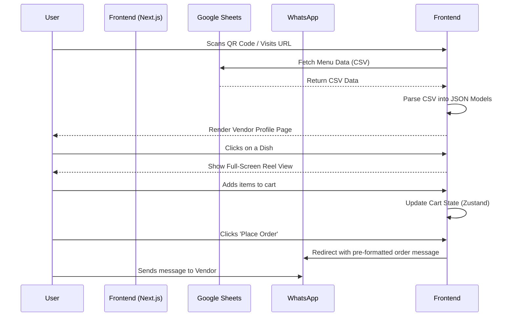

# YumYum Fullstack Architecture Document

### Section 1 of 18: Introduction

**Content:**

This document outlines the complete fullstack architecture for YumYum, including backend systems, frontend implementation, and their integration. It serves as the single source of truth for AI-driven development, ensuring consistency across the entire technology stack.

This unified approach combines what would traditionally be separate backend and frontend architecture documents, streamlining the development process for modern fullstack applications where these concerns are increasingly intertwined.

### Section 1.1 of 18: Starter Template or Existing Project

**Content:**

Based on the analysis of `brief.md` and `ui-architecture.md`, this is a greenfield project built from scratch. No starter templates (e.g., T3 Stack, Vercel templates) were used.

### Section 1.2 of 18: Change Log

**Content:**

| Date       | Version | Description                | Author              |
| :--------- | :------ | :------------------------- | :------------------ |
| 2025-10-12 | 1.0     | Initial document creation. | Hammaad (Architect) |

---

### Section 2 of 18: High Level Architecture

#### Technical Summary

**Content:**

The YumYum platform is designed as a serverless, mobile-first web application following Jamstack principles. The frontend is a Next.js application, hosted on Vercel, responsible for rendering the UI and handling all user interactions. The backend is a public Google Sheet, accessed via a CSV export URL (`gviz/tq`), which serves as a simple, vendor-managed database. This architecture is designed for rapid development, high performance, and low operational overhead, directly supporting the MVP goal of providing a blazing-fast digital menu.

#### Platform and Infrastructure Choice

**Content:**

- **Key Services:**
  - **Google Sheets:** As the primary data source.
  - **GitHub Actions:** As for crons.
  - **ImageKit:** For media hosting and optimization.
- **Deployment Host and Regions:** Vercel (Global Edge Network)

#### Repository Structure

**Content:**

- **Structure:** Monorepo
- **Monorepo Tool:** pnpm workspaces
- **Package Organization:**
  - `apps/client`: The main Next.js frontend application.
  - `packages/`: For any future shared libraries (e.g., `ui`, `config`).

#### High Level Architecture Diagram

**Content:**

```mermaid
graph TD
    subgraph "User"
        A[Customer's Mobile Device]
    end

    subgraph "Vercel Platform"
        B[Next.js Frontend App]
        C[ImageKit CDN]
    end

    subgraph "External Services"
        D[Google Sheet (as Database)]
        E[ImageKit (Media Hosting)]
        F[WhatsApp API]
        G[Google Analytics 4]
    end

    A -- Scans QR Code --> B
    B -- Serves Static Assets --> C
    C -- Delivers to --> A
    B -- Fetches Menu Data --> D
    B -- Fetches Images --> E
    B -- "Places Order (Client-Side Redirect)" --> F
    B -- Sends Analytics --> G
```

#### Architectural Patterns

**Content:**

- **Jamstack Architecture:** The frontend is pre-rendered and served from a global CDN, with dynamic functionality handled by client-side JavaScript.
  - _Rationale:_ This pattern ensures maximum performance, scalability, and security, which are key requirements for a "blazing-fast" user experience.
- **Component-Based UI:** The user interface is built using a collection of reusable React components.
  - _Rationale:_ This promotes code reuse, maintainability, and consistency, aligning with the use of Shadcn UI and modern React practices.
- **Serverless:** The architecture avoids traditional server management.
  - _Rationale:_ This minimizes operational complexity and cost, allowing the team to focus on feature development. The use of Google Sheets as a backend is a prime example of this approach.

---

### Section 3 of 18: Tech Stack

**Content:**

| Category             | Technology                                                                   | Version | Purpose                              | Rationale                                                                                   |
| :------------------- | :--------------------------------------------------------------------------- | :------ | :----------------------------------- | :------------------------------------------------------------------------------------------ |
| Frontend Language    | TypeScript                                                                   | latest  | Type safety and scalability          | Industry standard for modern web development, reduces errors.                               |
| Frontend Framework   | Next.js                                                                      | latest  | Core application framework           | Provides SSR, SSG, and a great developer experience.                                        |
| UI Component Library | Shadcn UI, Magic UI, Aceternity UI, React Bits, PatternCraft, Unicorn Studio | latest  | UI components and animations         | A rich ecosystem to accelerate development and achieve a high-quality, modern finish.       |
| State Management     | Zustand                                                                      | latest  | Global state management              | A small, fast, and scalable solution with a simple hook-based API.                          |
| Backend Language     | N/A                                                                          | N/A     | No custom backend logic              | The backend is a Google Sheet, simplifying the stack.                                       |
| Backend Framework    | N/A                                                                          | N/A     | No custom backend logic              | Data is fetched via a simple URL endpoint.                                                  |
| API Style            | REST-like (CSV endpoint)                                                     | N/A     | Data fetching from Google Sheets     | The `gviz/tq` endpoint provides a simple, REST-like way to get data without APIs.           |
| Database             | Google Sheets                                                                | N/A     | Primary data store for vendors       | Radically simple for the target user (vendors) to manage their menu.                        |
| Cache                | Local Storage (SWR)                                                          | N/A     | Caching application data client-side | Implements a 'Stale-While-Revalidate' strategy for an offline-capable, app-like experience. |
| File Storage         | ImageKit                                                                     | N/A     | Media hosting and optimization       | A powerful solution for managing and serving images efficiently.                            |
| Authentication       | N/A                                                                          | N/A     | All pages are public                 | The MVP focuses on a public-facing menu, no user authentication is required.                |
| Frontend Testing     | Jest & React Testing Library                                                 | latest  | Unit and integration testing         | Industry-standard tools for testing React applications.                                     |
| E2E Testing          | Playwright                                                                   | latest  | End-to-end user flow testing         | A modern and reliable choice for ensuring critical user journeys work as expected.          |
| Build Tool           | SWC (via Next.js)                                                            | latest  | Fast code compilation                | Integrated into Next.js for optimal performance.                                            |
| CI/CD                | Vercel                                                                       | N/A     | Continuous integration & deployment  | Seamlessly integrated with the hosting platform for automated builds and deploys.           |
| Monitoring           | Google Analytics 4                                                           | N/A     | User behavior and funnel tracking    | Provides essential product engagement KPIs.                                                 |
| Logging              | Lark Webhook                                                                 | N/A     | Critical error alerting              | A simple mechanism to alert the development team of critical data fetch failures.           |
| CSS Framework        | Tailwind CSS                                                                 | latest  | Utility-first styling                | Allows for rapid UI development and easy maintenance.                                       |

---

### Section 4 of 18: Data Models

**Content:**

#### Brand

- **Purpose:** Represents the vendor's brand identity and contact information, as defined in the `brand` tab of their Google Sheet.
- **TypeScript Interface:**
  ```typescript
  export interface Brand {
    name: string;
    logo_url: string;
    cuisine: string;
    address?: string;
    city?: string;
    description: string;
    payment_link: string;
    whatsapp: string;
    contact: string;
    location_link?: string;
    review_link?: string;
    instagram?: string;
    facebook?: string;
    youtube?: string;
    custom?: string;
    full_menu_pic?: string;
  }
  ```

#### Dish

- **Purpose:** Represents a single item on the menu, as defined in the `dishes` tab.
- **TypeScript Interface:**

  ```typescript
  export type InStockStatus = 'yes' | 'no' | 'hide';
  export type DietaryInfo = 'veg' | 'non-veg';
  export type DishTag =
    | 'bestseller'
    | "chef's special"
    | 'new'
    | 'limited edition'
    | 'normal';

  export interface Dish {
    id: string; // System-Generated from name, not a sheet column
    category: string;
    name: string;
    image: string;
    reel?: string;
    description: string;
    price: number;
    instock: InStockStatus;
    veg: DietaryInfo;
    tag?: DishTag;
  }
  ```

---

### Section 5 of 18: API Specification

**Content:**

The project does not have a traditional backend API (e.g., REST, GraphQL). Data is fetched directly from a public Google Sheet using a specific URL format that returns data as a CSV file.

- **Endpoint:** `https://docs.google.com/spreadsheets/d/{SHEET_ID}/gviz/tq?tqx=out:csv&sheet={SHEET_NAME}`
- **Method:** `GET`
- **Authentication:** None (the sheet must be public).
- **Response Format:** CSV

This approach is a core architectural decision for the MVP to ensure radical simplicity for the vendor, as it eliminates the need for any backend code or database management. All data parsing from CSV to the TypeScript models defined above happens on the client-side within the Next.js application.

---

### Section 6 of 18: Components

**Content:**

The UI is composed of a set of modular components, organized by feature and reusability.

#### `BrandHeader`

- **Responsibility:** Displays the vendor's logo, name, bio, and contact links.
- **Dependencies:** `Brand` data model.

#### `CategoryHighlights`

- **Responsibility:** Renders the horizontally-scrolling, Instagram-style category bubbles.
- **Dependencies:** `Dish[]` data model (derives categories from the list of dishes).

#### `DishGrid` / `DishCard`

- **Responsibility:** Displays the main grid of menu items on the profile page.
- **Dependencies:** `Dish` data model.

#### `ReelView`

- **Responsibility:** Provides the full-screen, vertical-scrolling menu browsing experience.
- **Dependencies:** `Dish` data model.

#### `CartSummary`

- **Responsibility:** A bottom-sheet drawer that shows the current order and allows checkout.
- **Dependencies:** `useCartStore` (Zustand).

---

### Section 7 of 18: External APIs

**Content:**

#### Google Sheets API

- **Purpose:** Serves as the primary database for all vendor and menu information.
- **Documentation:** N/A (uses the `gviz` CSV export URL, not the formal API).
- **Authentication:** None (requires public sheet access).

#### ImageKit API

- **Purpose:** Hosts, optimizes, and serves all media assets (vendor logos, dish images).
- **Documentation:** [https://docs.imagekit.io/](https://docs.imagekit.io/)
- **Authentication:** API Key and Secret for upload operations (server-side). Public URLs for consumption.

#### WhatsApp Click to Chat API

- **Purpose:** Enables the frictionless ordering flow by opening WhatsApp with a pre-formatted message.
- **Documentation:** [https://faq.whatsapp.com/general/chats/how-to-use-click-to-chat](https://faq.whatsapp.com/general/chats/how-to-use-click-to-chat)
- **Authentication:** None.

#### Google Analytics 4

- **Purpose:** Tracks user interactions, menu conversions, and other key performance indicators.
- **Documentation:** [https://developers.google.com/analytics/devguides/collection/ga4](https://developers.google.com/analytics/devguides/collection/ga4)
- **Authentication:** Measurement ID (public).

#### Lark Webhook API

- **Purpose:** Used for sending critical system alerts (e.g., data fetch failures, low ratings) to the development team's communication channel.
- **Documentation:** Specific to the configured incoming webhook URL.
- **Authentication:** None (relies on the secrecy of the webhook URL).

---

### Section 8 of 18: Core Workflows

**Content:**

#### Core Ordering Flow



---

### Section 9 of 18: Database Schema

**Content:**

The "database" is a structured Google Sheet. Each vendor has their own sheet, which must contain the following tabs with the specified columns, as defined in the PRD.

#### `brand` Tab

| Column          | Optionality | Description                                                          |
| :-------------- | :---------- | :------------------------------------------------------------------- |
| `name`          | Required    | The display name of the brand.                                       |
| `logo_url`      | Required    | URL for the brand's logo.                                            |
| `cuisine`       | Required    | Type of cuisine (e.g., "South Indian").                              |
| `description`   | Required    | A short bio for the brand.                                           |
| `payment_link`  | Required    | UPI or other payment deep link.                                      |
| `whatsapp`      | Required    | The number for receiving WhatsApp orders.                            |
| `contact`       | Required    | A primary contact phone number.                                      |
| `location_link` | Optional    | Google Maps link to the vendor's location.                           |
| `review_link`   | Optional    | The direct link for customers to leave a review.                     |
| `instagram`     | Optional    | Link to Instagram profile.                                           |
| `facebook`      | Optional    | Link to Facebook page.                                               |
| `youtube`       | Optional    | Link to YouTube channel.                                             |
| `custom`        | Optional    | A custom link (will use a generic 'link' icon).                      |
| `full_menu_pic` | Optional    | URL to a single, static image of the full menu for offline fallback. |

#### `dishes` Tab

_Note: The `id` field is system-generated from the `name` during data fetch and is not an actual column in the sheet._
| Column | Description |
| :--- | :--- |
| `category` | The menu category this dish belongs to. |
| `name` | The name of the dish. Used to generate the `id`. |
| `image` | URL for the primary dish image. |
| `reel` | (Optional) URL for a short video/reel of the dish. |
| `description`| A short, appealing description. |
| `price` | The price of the item. |
| `instock` | Availability. Must be one of: `yes`, `no`, `hide`. |
| `veg` | Dietary info. Must be one of: `veg`, `non-veg`. |
| `tag` | (Optional) Special tag. One of: `bestseller`, `chef's special`, `new`, `limited edition`, `normal`. |

---

### Section 10 of 18: Frontend Architecture

**Content:**

The frontend architecture is detailed extensively in the `docs/ui-architecture.md` document. This section provides a high-level summary.

- **Component Organization:** Components are structured into `ui/` (Shadcn primitives), `shared/` (reusable across features), and `features/` (feature-specific).
- **State Management:** Global state (e.g., the shopping cart) is managed by Zustand. Local component state is managed with React hooks (`useState`, `useReducer`).
- **Routing:** Handled by the Next.js App Router, with a dynamic route `/[vendor_slug]` serving as the main entry point.
- **Data Fetching:** A dedicated service layer in `src/services/gsheets.ts` is responsible for fetching and parsing all data from the Google Sheets backend. This layer will implement caching and error handling.

---

### Section 11 of 18: Backend Architecture

**Content:**

There is no traditional backend application server or custom API. The "backend" consists of two main components:

1.  **Data Layer:** A public Google Sheet, which acts as a simple, vendor-managed database.
2.  **Media Layer:** ImageKit, which handles all image storage, optimization, and delivery.

This serverless, backend-less approach is a deliberate choice for the MVP to maximize simplicity and minimize operational overhead. Any future server-side logic (e.g., processing webhooks) will be implemented using Vercel Functions.

---

### Section 12 of 18: Unified Project Structure

**Content:**

```plaintext
/apps/client/
└── src/
    ├── app/
    │   ├── [vendor_slug]/
    │   │   ├── page.tsx
    │   │   └── layout.tsx
    │   ├── globals.css
    │   └── layout.tsx
    ├── components/
    │   ├── ui/
    │   ├── shared/
    │   └── features/
    ├── lib/
    │   ├── constants.ts
    │   ├── utils.ts
    │   └── types.ts
    ├── services/
    │   └── gsheets.ts
    └── store/
        └── use-cart.store.ts
```

---

### Section 13 of 18: Development Workflow

**Content:**

#### Local Development Setup

- **Prerequisites:** `pnpm`, `Node.js`
- **Initial Setup:** `pnpm install`
- **Development Commands:**
  - Start dev server: `pnpm dev`
  - Run tests: `pnpm test`
  - Build for production: `pnpm build`

#### Environment Configuration

- All environment variables are managed in an `.env.local` file in the `apps/client` directory. See the `ui-architecture.md` for the full list of required variables.

---

### Section 14 of 18: Deployment Architecture

**Content:**

#### Deployment Strategy

- **Platform:** Vercel
- **Deployment Method:** Continuous Deployment via Git integration. Every push to the `main` branch will trigger an automatic build and deployment to production. Preview deployments will be created for all pull requests.
- **Frontend Deployment:**
  - **Build Command:** `pnpm build`
  - **Output Directory:** `.next`
  - **CDN/Edge:** Handled automatically by Vercel's Global Edge Network.

#### CI/CD Pipeline

- The CI/CD pipeline is managed entirely by Vercel. The `vercel.json` file can be used to configure project-specific settings if needed.

---

### Section 15 of 18: Security and Performance

**Content:**

#### Security Requirements

- **Data Security:** The primary data source (Google Sheet) is public by design. No sensitive user data is stored.
- **Frontend Security:** Standard web security best practices will be followed (e.g., preventing XSS). Vercel provides additional protections at the edge.

#### Performance Optimization

- **Loading Strategy:** Next.js provides automatic code splitting, static site generation (SSG), and server-side rendering (SSR) to ensure fast initial page loads.
- **Media Optimization:** All images are served via ImageKit for automatic optimization and format selection.
- **Caching:** Data fetched from Google Sheets is cached on the client-side using a Local Storage-based "Stale-While-Revalidate" (SWR) strategy. Static assets are cached at browser.

---

### Section 16 of 18: Testing Strategy

**Content:**

The testing strategy follows the "Testing Pyramid" model, focusing on a large base of unit tests, a smaller set of integration tests, and a few critical end-to-end tests.

- **Unit Tests:** Jest & React Testing Library will be used to test individual components and utility functions in isolation.
- **Integration Tests:** Will test the interaction between multiple components, such as the process of adding an item to the cart and seeing the summary update.
- **E2E Tests:** Playwright will be used to simulate a full user journey, from landing on the page to successfully preparing an order for WhatsApp.

---

### Section 17 of 18: Coding Standards

**Content:**

All frontend development must adhere to the standards defined in `docs/ui-architecture.md`.

- **Critical Rules:**
  1.  Never fetch data directly in components; use the service layer.
  2.  Use Zustand for global state only; prefer local state.
  3.  Style with Tailwind utility classes; avoid custom CSS files.
  4.  Use environment variables for all secrets.
  5.  Maintain strict TypeScript typing; avoid `any`.
- **Naming Conventions:** Follow the `PascalCase` for components and `useCamelCase` for hooks convention.

---

### Section 18 of 18: Error Handling & Monitoring

**Content:**

#### Error Handling

- **Data Fetching:** If the Google Sheet data fails to load, the UI will display a user-friendly error message.
- **Critical Alerts:** On a critical data fetch failure, a notification will be sent to a pre-configured Lark webhook to alert the development team immediately.

#### Monitoring

- **User Analytics:** Google Analytics 4 will be used to monitor user behavior, track the conversion funnel (`menu_views` -> `order_placed_clicks`), and gather insights on product engagement.
- **Performance:** Vercel Analytics will be used to monitor Core Web Vitals and overall application performance.
